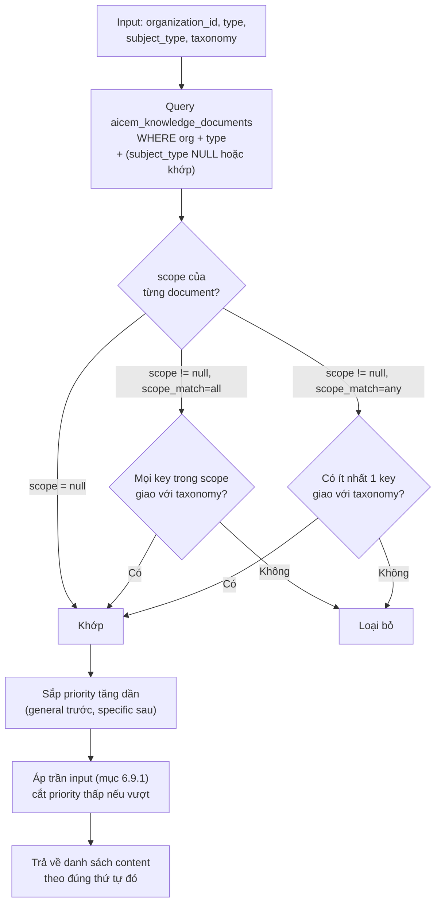

# AI Context Engineering Module (AICEM)
**Đặc tả Kỹ thuật Chi tiết – Sẵn sàng Triển khai**

**Phiên bản:** 2.0 (viết lại để khớp hệ thống thật)
**Ngày:** 09/07/2026
**Framework:** Laravel 13 (PHP 8.4) + NWIDART Modules — **không dùng FilamentPHP**
**Hệ thống:** Nền tảng multi-tenant (Organization-scoped) — AICEM là tính năng AI gắn vào module `Post` (bài viết + CTA sản phẩm), không phải toàn hệ thống
**Trạng thái:** Bản viết lại v2 — thay thế toàn bộ v1 (v1 giả định Laravel 11 + FilamentPHP và storage phẳng không phân biệt tenant, không phù hợp với repo hiện tại)

> **Ghi chú thay đổi so với v1:** v1 do "Grok AI Design Team" soạn dựa trên khung tổng quát (kprasadrao context engineering), không đọc codebase thật nên bị lệch 3 điểm nghiêm trọng: (1) tech stack sai (Filament không tồn tại trong repo), (2) knowledge base lưu file phẳng `storage/app/aicem/...` sẽ vi phạm multi-tenancy vì hệ thống bắt buộc mọi dữ liệu phải scope theo `organization_id`, (3) bỏ qua các pattern đã có sẵn trong repo (permission 4-cấp `sales_ai.*`, AI provider packages đã cài nhưng chưa có abstraction, Action/Job pattern của module Assessment). Bản v2 sửa cả ba.

## Mục lục

1. Giới thiệu & Mục tiêu
2. Nguyên tắc Context Engineering (áp dụng vào hệ thống thật)
3. Yêu cầu Chức năng & Phi chức năng
4. Cấu trúc Module & Vị trí trong hệ thống
5. Knowledge Base — Schema & Versioning
6. Context Engineering Framework & Template
7. Database Schema & Models
8. AI Provider Abstraction Layer (dùng chung toàn hệ thống)
9. Workflow (thay "Slash Command" bằng UI Action + Job nền)
10. Core Services & Laravel Implementation
11. Tích hợp với Article Authoring & Approval hiện có
12. User Flow chi tiết theo Role
13. Security, Audit, Cost Control, Monitoring
14. Acceptance Criteria & Testing Strategy
15. Roadmap Triển khai

---

## 1. Giới thiệu & Mục tiêu

AICEM cung cấp trợ lý AI cho quy trình biên soạn bài viết trong `Modules/Post`: sinh/tối ưu headline, audit SEO/E-E-A-T, tối ưu toàn bài — dựa trên một "bộ DNA nội dung" (giọng văn, đối tượng đọc, quy chuẩn SEO) mà **mỗi tổ chức (Organization) tự cấu hình riêng**, vì đây là nền tảng multi-tenant: mỗi khách hàng dùng hệ thống có thể là một tòa soạn/nhãn hàng khác nhau với giọng văn và audience khác nhau.

Mục tiêu không phải "tự động viết bài thay biên tập viên", mà là **advisory**: AI đề xuất, biên tập viên (Marketing) chấp nhận/từ chối theo từng trường/từng block, CEO/Ops vẫn là người duyệt & publish như quy trình hiện có — AICEM không thay thế bước duyệt.

## 2. Nguyên tắc Context Engineering (áp dụng vào hệ thống thật)

Giữ nguyên tinh thần "context engineering" của v1 (tách DNA chuyên môn khỏi prompt runtime, versioned, có ví dụ tốt/xấu) nhưng áp dụng vào đúng ràng buộc của repo:

- **Tenant-scoped, không phải global file.** Mọi tài liệu DNA (SKILL, brand guideline, persona, quy tắc SEO, checklist E-E-A-T, ví dụ tốt/xấu) là dữ liệu thuộc 1 `organization_id`, lưu trong DB (mục 5), không phải file tĩnh trong `storage/app`.
- **Versioned bằng pattern đã có, không tự chế.** `Modules/Assessment` đã có sẵn pattern snapshot cấu hình (`AssessmentConfigSnapshot`, `CreateConfigSnapshotAction`, `RestoreConfigFromSnapshotAction`) — AICEM tái dùng đúng pattern này cho knowledge base và template, thay vì tự nghĩ ra hệ thống version_history mới.
- **Block-based, không phải văn bản phẳng.** Nội dung bài viết là chuỗi `PostContentBlock` (`text`/`product`), không có field "body" duy nhất — mọi template/prompt phải render và trả kết quả theo cấp block.
- **Advisory, không auto-overwrite.** AI trả về *suggestion* gắn với 1 field hoặc 1 block cụ thể; biên tập viên accept từng cái — không có action nào ghi đè trực tiếp vào `PostArticle`/`PostContentBlock` mà không qua bước accept.
- **Seed mặc định qua file Markdown (git-tracked), runtime qua DB.** File `.md` (SKILL.md, brand_guidelines.md...) vẫn có ích — nhưng chỉ là **seed template** đóng gói cùng module (để onboarding 1 tổ chức mới nhanh), được nạp vào DB khi tạo Organization. Sau đó tổ chức chỉnh sửa nội dung này trong DB qua UI, không sửa file.

## 3. Yêu cầu Chức năng & Phi chức năng

**Chức năng:**
- CRUD knowledge base (SKILL, brand guideline, persona, SEO rules, EEAT checklist, ví dụ tốt/xấu) theo Organization, có version history + rollback.
- CRUD context template (JSON) quy định cách ghép knowledge base + nội dung bài viết thành prompt.
- CRUD workflow (headline / seo_audit / full_optimization), mỗi workflow gắn 1 prompt template + áp dụng cho `ArticleFormat` nào.
- Chạy workflow trên 1 `PostArticle` cụ thể → sinh suggestion theo field/block → editor accept/reject từng cái.
- Theo dõi chi phí (token, USD) theo Organization, theo user, có hạn mức.
- Audit log đầy đủ mọi lần gọi AI (ai, khi nào, tốn bao nhiêu, kết quả).

**Phi chức năng:**
- Không được chặn (block) request HTTP khi gọi AI — vì LLM call có thể mất 5–30s. Chạy qua queue job, không đồng bộ trong controller.
- Cách ly tenant tuyệt đối: Organization A không bao giờ đọc được knowledge base/generation log của Organization B (đảm bảo bằng `TenantAwareModel` + global scope có sẵn).
- Provider AI phải thay được (OpenAI ⇄ Anthropic) không đổi code gọi ở tầng nghiệp vụ.
- Không log API key hoặc nội dung prompt đầy đủ ra log hệ thống chung (chỉ audit log riêng, có kiểm soát quyền xem).

## 4. Cấu trúc Module & Vị trí trong hệ thống

AICEM là **module mới** `Modules/Aicem`, theo đúng kiến trúc Feature-folder đã dùng trong `Modules/Post` (không dùng Filament Resource):

```
Modules/Aicem/
├── app/
│   ├── Enums/
│   │   ├── KnowledgeDocumentType.php   // 5 giá trị DNA chung (skill|brand_guideline|audience_personas|example_good|example_bad) — KHÔNG closed-enum toàn phần, xem mục 6.3: type chuyên môn theo module tra động qua knowledge_slots của registry, không liệt hết ở đây
│   │   ├── ScopeMatch.php              // any | all — mục 5.2/6.7, nhân bản pattern ConditionMatch của WorkflowAutomation
│   │   ├── GenerationRunStatus.php     // pending | running | succeeded | failed
│   │   └── SuggestionStatus.php        // pending | accepted | rejected | stale (stale: subject đổi từ lúc generate — mục 9.1)
│   ├── Models/
│   │   ├── AicemKnowledgeDocument.php
│   │   ├── AicemKnowledgeDocumentVersion.php
│   │   ├── AicemContextTemplate.php
│   │   ├── AicemWorkflow.php
│   │   ├── AicemGenerationRun.php
│   │   └── AicemSuggestion.php
│   ├── Contracts/
│   │   └── AicemSubjectResolver.php    // adapter mà mỗi module chỉ định phải cung cấp — xem mục 6
│   ├── Support/Resolvers/
│   │   ├── PostArticleSubjectResolver.php
│   │   └── ProductSubjectResolver.php
│   ├── Features/
│   │   ├── KnowledgeBase/{Actions,Data,Http,Queries}
│   │   ├── ContextTemplate/{Actions,Data,Http,Queries}
│   │   ├── WorkflowManagement/{Actions,Data,Http,Queries}
│   │   └── Generation/{Actions,Jobs,Data,Http,Queries}
│   ├── Policies/
│   │   ├── AicemKnowledgeDocumentPolicy.php
│   │   └── AicemWorkflowRunPolicy.php
│   └── Providers/AicemServiceProvider.php
├── config/aicem_subjects.php           // registry: subject_type → model/resolver/field/quyền — xem mục 6
├── database/migrations/
├── database/seeders/AicemPermissionSeeder.php
├── resources/
│   ├── views/admin/knowledge-base/...
│   ├── views/admin/workflows/...
│   ├── views/components/panel.blade.php   // panel AI dùng chung, include vào view của module chỉ định
│   └── knowledge_base_seeds/         // .md seed mặc định, git-tracked — tổ chức theo content vertical, xem mục 5.4
│       ├── generic/                  // vertical bắt buộc phải có — fallback khi Organization chưa chọn/không khớp vertical nào
│       │   ├── dna/                  // tầng 1 — scope=null, subject_type=null
│       │   │   ├── skill.md
│       │   │   ├── brand_guidelines.md
│       │   │   └── audience_personas.md
│       │   ├── post_article/         // tầng 2 — subject_type=post_article, scope=null (điểm khởi đầu, tổ chức tự thêm scope cụ thể sau)
│       │   │   ├── eeat_checklist.md
│       │   │   ├── category_style_guide.md
│       │   │   └── seo_keyword_rules.md
│       │   └── product/              // tầng 2 — subject_type=product, scope=null
│       │       ├── ads_compliance_rules.md
│       │       ├── conversion_copy_rules.md
│       │       └── pricing_display_rules.md
│       ├── news_publisher/           // vertical tuỳ chọn — cùng cấu trúc con {dna,post_article,product} như generic/
│       ├── marketing_brand/          // vertical tuỳ chọn — chưa làm ở Phase 1, thêm dần khi có khách hàng thuộc ngành này
│       ├── ecommerce/
│       └── health_blog/
└── routes/{web.php,api.php}
```

`app/Services/AI/` (ngoài module, thuộc `app/` chung — xem mục 8) là tầng abstraction provider, dùng chung cho AICEM và các tính năng AI khác đã có permission nhưng chưa implement (`sales_ai.*`, `workflow.ai_config`, `assessment.reprocess`).

**AICEM không chỉ gắn với Post.** Danh sách "module được chỉ định" hiện tại: **Post** (bài viết, block-based) và **Product** (catalog sản phẩm, field-based, dùng chung cho Post CTA Box). Vì vậy AICEM không được viết cứng theo `PostArticle`/`PostContentBlock` — mục 6 định nghĩa lớp adapter (`AicemSubjectResolver`) để mỗi module chỉ định tự khai báo field/block của mình, AICEM chỉ biết làm việc qua adapter này. Thêm module thứ 3 vào danh sách chỉ định (ví dụ Survey, Assessment sau này) chỉ cần viết 1 resolver mới + đăng ký trong `config/aicem_subjects.php`, không sửa code lõi của AICEM.

Panel AICEM là 1 Blade component dùng chung (`Modules/Aicem/resources/views/components/panel.blade.php`, nhận `subject_type` + `subject_id` làm prop), được **nhúng vào** view sửa của từng module chỉ định: `Modules/Post/resources/views/admin/articles/edit.blade.php` và `Modules/Product/resources/views/admin/products/edit.blade.php` (tên file thực tế theo `ProductAdminController`) — không tạo trang biên tập riêng cho AICEM.

Ngoài `subject_type`/`subject_id`, component nhận thêm 2 prop suy ra **từ registry** (không tự đoán trong Blade, tránh lệch với 6.3): `allowedFields` (= `config("aicem_subjects.$subjectType.fields")`, dùng để chỉ hiện nút "Nhận đề xuất" cạnh đúng field khai báo, field khác của form giữ nguyên không có tương tác AI) và `allowBlockEdit` (= `config("aicem_subjects.$subjectType.has_blocks")`, `false` thì panel ẩn hẳn khu vực suggestion theo block — trường hợp Product). View của module chỉ định truyền 2 prop này khi include component, ví dụ `<x-aicem::panel :subject-type="'post_article'" :subject-id="$article->id" :allowed-fields="config('aicem_subjects.post_article.fields')" :allow-block-edit="config('aicem_subjects.post_article.has_blocks')" />` — nhờ vậy component không cần biết gì về `PostArticle`/`Product`, chỉ render theo đúng field/block được phép.

Thêm 1 prop thứ 3, `subjectTaxonomyPreview` (= `$resolver->taxonomy($subject)`, gọi qua controller trước khi render view — mục 6.2), để panel hiển thị ngay 1 dòng tóm tắt bối cảnh đang áp dụng cho bài viết/sản phẩm này (VD "category_slugs: an-toan-giac-ngu · format: article"), **trước khi** editor bấm chạy workflow. Đây chính là dữ liệu mà `ResolveApplicableKnowledgeAction` (mục 6.7) sẽ dùng để chọn document — hiển thị trước giúp editor hiểu tại sao 2 bài cùng loại lại nhận gợi ý khác nhau, không cần đợi xem log/audit sau khi chạy xong.

## 5. Knowledge Base — Schema & Versioning

### 5.1. Ba tầng context, không phải hai

Bản trước mới tách 2 tầng (DNA chung toàn org / chuyên môn theo `subject_type`). Thực tế còn 1 tầng thứ 3 quan trọng hơn: **context khác theo từng bài viết/sản phẩm cụ thể**, vì 2 bài cùng `subject_type=post_article` (cùng field, cùng block) nhưng khác category/format thì cần chuyên môn khác hẳn — ví dụ bài "An toàn giấc ngủ" cần dẫn nguồn y khoa nghiêm ngặt, bài "Hoạt động cuối tuần" thì không. Do đó:

1. **Tầng DNA (org-wide):** `scope = null` — áp dụng cho mọi bài/sản phẩm của tổ chức (giọng văn, tầm nhìn thương hiệu).
2. **Tầng chuyên môn theo module (`subject_type`):** cố định danh mục trong `knowledge_slots` của `config/aicem_subjects.php` (mục 6.3) — loại tri thức nào tồn tại cho Post khác Product.
3. **Tầng theo instance (`scope`):** mỗi `aicem_knowledge_document` có thể gắn điều kiện chọn lọc theo thuộc tính thật của bài/sản phẩm (category, format, tag, mức giá...) — **tự động resolve lại khác nhau cho từng bài viết** tại thời điểm build prompt, không cấu hình tĩnh 1 lần cho cả `subject_type`.

### 5.2. Schema có `scope` — tái dùng pattern `ConditionMatch` đã có trong `WorkflowAutomation`

`Modules/WorkflowAutomation/app/Enums/ConditionMatch.php` (`None|All|Any`) + `ConditionEvaluator` đã giải đúng bài toán "1 tập điều kiện, khớp kiểu AND hay OR" cho workflow trigger. AICEM không import module đó (tránh phụ thuộc chéo vào 1 module khác còn placeholder), mà **nhân bản cùng pattern** trong `Modules/Aicem/app/Enums/ScopeMatch.php` (`Any|All`, không cần `None` vì `scope = null` đã thay thế "không điều kiện").

```
aicem_knowledge_documents (bổ sung so với mục 7 bản trước)
  ..., scope (json, nullable), scope_match (enum any|all, default any), priority (int, default 100)
```

- `scope = null` → luôn khớp (tầng DNA hoặc tri thức chuyên môn áp dụng chung cho mọi bài/sản phẩm).
- `scope = {"category_slugs": ["an-toan-giac-ngu"], "format": ["tip"]}` → chỉ khớp khi thuộc tính thật của subject giao với **từng key**; `scope_match=all` yêu cầu mọi key đều khớp, `scope_match=any` chỉ cần 1 key khớp.
- `priority` quyết định thứ tự chèn vào prompt khi nhiều document cùng `type` cùng khớp (general trước, specific sau — số nhỏ chèn trước) — kèm 1 câu chỉ dẫn cố định trong prompt: *"Nếu các đoạn hướng dẫn mâu thuẫn, ưu tiên đoạn xuất hiện sau."* Xem thuật toán resolve đầy đủ + ví dụ cụ thể ở mục 6.7–6.8.

`aicem_knowledge_documents` — bản hiện hành: `id, organization_id, type, subject_type (nullable), scope (json, nullable), scope_match, priority, title, content (longText, markdown), current_version, created_by, updated_by, timestamps`.
`aicem_knowledge_document_versions` — lịch sử: `id, knowledge_document_id, version, content, scope, changed_by, changed_at` (version snapshot phải lưu cả `scope` lúc đó, vì đổi điều kiện áp dụng cũng là 1 thay đổi cần rollback được, không chỉ đổi `content`). Mỗi lần `UpdateKnowledgeDocumentAction` chạy → tạo version mới trước khi update bản hiện hành (giống `CreateConfigSnapshotAction`).
Ví dụ tốt/xấu (`example_good`/`example_bad`) cũng dùng `scope` — 1 ví dụ mẫu có thể chỉ đại diện cho 1 category/format cụ thể, không nên trộn lẫn vào prompt của category khác.

### 5.3. Onboarding Organization mới — seed cả tầng 1 và tầng 2, tầng 3 để tổ chức tự thêm

`AicemServiceProvider` lắng nghe event tạo Organization → xác định **content vertical** của tổ chức (mục 5.4) → đọc `resources/knowledge_base_seeds/{vertical}/dna/*.md` **và** `resources/knowledge_base_seeds/{vertical}/{post_article,product}/*.md` → tạo `aicem_knowledge_documents` mặc định, tất cả với `scope = null` (áp dụng chung, chưa phân theo category/format/mức giá cụ thể). Đây là điểm khởi đầu "chạy được ngay" cho tổ chức mới — không phải bản hoàn chỉnh.

Tầng 3 (tri thức theo scope cụ thể — VD "nệm/chăn cho trẻ sơ sinh phải dẫn nguồn y khoa", "sản phẩm premium tránh ngôn ngữ giá rẻ") **không seed sẵn**, vì đó là kiến thức chuyên biệt của từng tổ chức (ngành y tế/nuôi dạy con khác ngành bán lẻ) — AI_Operator của tổ chức tự bổ sung dần qua UI khi phát sinh nhu cầu thật (mục 6.8), không đoán trước cho mọi khách hàng của nền tảng.

### 5.4. Content Vertical — preset DNA theo ngành, chỉ là điểm khởi đầu seed, không phải tầng resolve runtime

**Mô hình:** nền tảng cung cấp sẵn 1 bộ DNA mặc định theo từng loại hình nội dung/biên tập phổ biến ("content vertical" — VD tòa soạn tin tức, nhãn hàng marketing, e-commerce, blog sức khỏe), mỗi Organization khi onboarding chọn 1 vertical gần nhất với mình làm **điểm khởi đầu**, sau đó tự do cá nhân hoá sâu hơn (giọng văn riêng, audience riêng, quy chuẩn SEO riêng) ngay trong knowledge base của chính mình.

**Quan trọng — đây KHÔNG phải 1 tầng resolve mới cộng thêm vào runtime.** 3 tầng context ở mục 5.1 (DNA org-wide / chuyên môn theo subject_type / theo instance qua `scope`) giữ nguyên, và toàn bộ nội dung vẫn nằm trong `aicem_knowledge_documents` với `organization_id` của chính tổ chức — không có bảng "system-level, dùng chung nhiều Organization" nào mới, không phá nguyên tắc cách ly tenant ở mục 3. Content vertical chỉ quyết định **seed lúc onboarding đọc thư mục `.md` nào** (mục 5.3/7.1) — sau khi seed xong, dữ liệu 100% thuộc về Organization, không còn liên hệ runtime với preset gốc. Platform cải thiện preset của 1 vertical sau này **không** tự động lan tới Organization đã onboard trước đó (đã ghi nhận là đánh đổi chấp nhận được — đơn giản hơn 1 cơ chế 2-tầng sống, tránh phải thêm bảng non-tenant + logic resolve + role quản trị cấp platform mới cho 1 nhu cầu chưa phát sinh thật).

**Không tái dùng `organizations.industry`.** Cột này (đã có sẵn, `Modules/Organization`) là ngành nghề kinh doanh/pháp lý do người dùng nhập tự do (VD "Bất động sản", "Y tế & Dược phẩm" — dùng cho hồ sơ doanh nghiệp), khác hoàn toàn với "content vertical" của AICEM (loại hình nội dung/biên tập, quyết định giọng văn và tri thức chuyên môn cần có). Ép 2 khái niệm vào chung 1 cột sẽ vừa không khớp ngữ nghĩa vừa không tin cậy được để tra thư mục seed (giá trị tự do, không phải 1 tập cố định). AICEM thêm cột riêng qua extension migration (cùng kiểu với `ai_provider_config`/`ai_rate_limit_override` ở mục 8.6/13):

```
organizations.aicem_content_vertical (string, nullable) -- key tra config/aicem_content_verticals.php, NULL = dùng 'generic'
```

```php
// config/aicem_content_verticals.php — danh sách vertical hợp lệ, quyết định thư mục seed tương ứng
return [
    'generic'          => ['label' => 'Mặc định (chưa phân loại)'],   // bắt buộc luôn tồn tại, dùng khi vertical = null hoặc không khớp seed folder nào
    'news_publisher'   => ['label' => 'Tòa soạn tin tức'],
    'marketing_brand'  => ['label' => 'Nhãn hàng / Marketing'],
    'ecommerce'        => ['label' => 'E-commerce / Bán lẻ'],
    'health_blog'      => ['label' => 'Blog sức khoẻ'],
];
```

Cột này thuộc quyền `AICEM_CONFIG` (System Admin, mục 12) — chọn lúc tạo Organization hoặc sửa sau đó qua trang cấu hình AICEM. **Đổi vertical sau khi đã seed không tự động ghi đè/xoá nội dung đã tồn tại** (đúng theo tính idempotent của `SeedDefaultKnowledgeBaseAction`, mục 7.1 — action chỉ insert phần chưa có, không insert lại phần đã tồn tại) — muốn nạp lại preset của vertical khác cho 1 Organization đã seed rồi là thao tác thủ công (xoá document cũ trước khi chạy lại seed), không tự động hoá ở phiên bản này để tránh rủi ro xoá nhầm nội dung tổ chức đã tự tuỳ biến.

## 6. Context Engineering Framework & Template

### 6.1. Vấn đề: 2 module chỉ định có 2 hình dạng nội dung khác nhau

- **Post** (`PostArticle`): field rời (`title`, `excerpt`, `seo_title`, `seo_description`) **+** nội dung dạng chuỗi block (`PostContentBlock`, type `text`/`product`) — AI chỉ được sửa block `text`, không đụng block `product`.
- **Product** (`Product`): chỉ có field rời (`name`, `short_description`, `description`, ...), **không có** khái niệm block.

Nếu template hard-code `content_blocks`/`article_meta` như bản v1 thì không tái dùng được cho Product. Do đó AICEM định nghĩa 1 **adapter contract** mà mỗi module chỉ định phải cài đặt, và template JSON chỉ nói chuyện qua field/block **trừu tượng**, không qua tên cột thật của từng module.

### 6.2. Adapter contract — `AicemSubjectResolver`

```php
namespace Modules\Aicem\Contracts;

use Illuminate\Database\Eloquent\Model;

interface AicemSubjectResolver
{
    /** Giá trị hiện tại của các field khai báo trong config, keyed theo field code trừu tượng. */
    public function fields(Model $subject): array;

    /** [] nếu subject_type không hỗ trợ block. Mỗi item: ['block_id' => int, 'type' => string, 'body' => string]. */
    public function blocks(Model $subject): array;

    /** Ghi 1 suggestion field đã được accept — phải đi qua Action gốc của module chỉ định, không update() trực tiếp. */
    public function applyFieldSuggestion(Model $subject, string $field, string $suggestedText, int $userId): void;

    /** Ghi 1 suggestion block đã được accept. Không được gọi nếu subject_type không hỗ trợ block. */
    public function applyBlockSuggestion(Model $subject, int $blockId, string $suggestedText, int $userId): void;

    /** Thuộc tính phân loại của CHÍNH instance này, dùng để resolve knowledge document theo scope (mục 6.7). Keyed theo taxonomy_keys khai trong registry. */
    public function taxonomy(Model $subject): array;
}
```

**`PostArticleSubjectResolver`** — `fields()` đọc trực tiếp 4 cột; `blocks()` đọc `contentBlocks()` lọc `type = text`; `applyFieldSuggestion()`/`applyBlockSuggestion()` gọi `UpdateArticleAction`/`SyncContentBlocksAction` đã có (không viết logic ghi bài viết mới); `taxonomy()` trả `['category_slugs' => $article->categories->pluck('slug'), 'format' => [$article->format->value], 'tag_slugs' => $article->tags->pluck('slug')]`.

**`ProductSubjectResolver`** — `blocks()` luôn trả `[]`; `applyFieldSuggestion()` phải build lại 1 `ProductData` đầy đủ (merge giá trị hiện tại của `Product` + field vừa được accept) rồi gọi `UpdateProductAction::handle()`, vì action này nhận `ProductData` nguyên khối, không nhận partial update; `taxonomy()` trả `['category_slugs' => [...], 'price_tier' => [PriceTierBucketer::bucket($product->price)], 'link_types' => ...]` — `price_tier` là 1 giá trị **suy ra** (budget/mid/premium theo ngưỡng cấu hình được, không phải cột DB có sẵn), thể hiện rằng `taxonomy()` được phép tính toán, không chỉ đọc thẳng cột.

### 6.3. Registry `config/aicem_subjects.php`

```php
return [
    'post_article' => [
        'model'    => \Modules\Post\Models\PostArticle::class,
        'resolver' => \Modules\Aicem\Support\Resolvers\PostArticleSubjectResolver::class,
        'label'    => 'Bài viết',
        'fields'   => ['title', 'excerpt', 'seo_title', 'seo_description'],
        'field_constraints' => [                   // (tuỳ chọn) ràng buộc độ dài/định dạng per-field để ValidateSuggestionsAction loại sớm — mục 6.9.2/11.1
            'title'       => ['max' => 255],
            'seo_title'   => ['max' => 60],
        ],
        'has_blocks' => true,
        'block_editable_types' => ['text'],       // block 'product' luôn bị loại khỏi prompt
        'use_permission' => 'aicem.use',           // permission Spatie cần có để chạy AI trên subject này
        'knowledge_slots' => [                     // tri thức chuyên môn riêng cho Post — mục 5.1 tầng 2
            'eeat_checklist',
            'category_style_guide',
            'seo_keyword_rules',
        ],
        'taxonomy_keys' => ['category_slugs', 'format', 'tag_slugs'],  // key hợp lệ để đặt "scope" — mục 5.2/6.7
    ],
    'product' => [
        'model'    => \Modules\Product\Models\Product::class,
        'resolver' => \Modules\Aicem\Support\Resolvers\ProductSubjectResolver::class,
        'label'    => 'Sản phẩm',
        'fields'   => ['name', 'short_description', 'description'],
        'field_constraints' => ['name' => ['max' => 250]],  // khớp #[Max(250)] của ProductData — mục 11.1
        'has_blocks' => false,
        'use_permission' => 'aicem.use',
        'knowledge_slots' => [
            'ads_compliance_rules',
            'conversion_copy_rules',
            'pricing_display_rules',
        ],
        'taxonomy_keys' => ['category_slugs', 'price_tier', 'link_types'],
    ],
];
```

Đây là **nguồn sự thật duy nhất** cho: (1) field/block nào AI được đụng tới, (2) loại tri thức chuyên môn nào tồn tại cho subject_type này, (3) key nào hợp lệ khi đặt `scope` cho 1 knowledge document. Mọi validation ở bước sau (lưu knowledge document, lưu template, build prompt) đều tra đúng registry này — không lặp lại danh sách ở nơi khác. `aicem_knowledge_documents.type` do đó không còn là PHP enum đóng — hợp lệ nếu rơi vào 1 trong 4 trường hợp: (a) thuộc 3 loại DNA chung `skill|brand_guideline|audience_personas` (mục 5.1 tầng 1, bắt buộc `subject_type = null`), (b) thuộc `knowledge_slots` của đúng `subject_type` (tầng 2, bắt buộc có `subject_type`), (c) = `example_good`/`example_bad` (bắt buộc có `subject_type`, không trộn ví dụ giữa 2 module), hoặc (d) = `custom_note` (slot thoát hiểm, luôn hợp lệ, dùng cho ghi chú ad-hoc không cần deploy).

### 6.3.1. `knowledge_slot_definitions` — tránh magic string khi validate `type`

Liệt kê (a)-(d) ở trên là **quy tắc**, nhưng nếu chỉ tra bằng cách so string rời rạc (`in_array($type, [...])` lặp lại ở `SaveKnowledgeDocumentAction`, ở seeder, ở UI dropdown...) thì mỗi chỗ có nguy cơ lệch danh sách. Thay vào đó, cùng `config/aicem_subjects.php` khai thêm 1 khoá top-level `knowledge_slot_definitions` — bảng tra duy nhất cho **mọi** `type` hợp lệ trong toàn hệ thống, kể cả 2 loại không gắn 1 `subject_type` cụ thể (`example_good`/`example_bad`/`custom_note`):

```php
// config/aicem_subjects.php — khoá top-level, tách khỏi mảng theo subject_type ở mục 6.3
//
// subject_type_required: bắt buộc phải có 1 subject_type non-null khi lưu?
// subject_type_allowed:  [] = phải là null (không được set) | [...] = chỉ được 1 trong các giá trị này | null = chấp nhận
//                         bất kỳ subject_type nào đã đăng ký trong registry (mục 6.3) — dùng cho loại type dùng chung
//                         nhiều module, tránh chuỗi 'any' mơ hồ như bản trước.
'knowledge_slot_definitions' => [
    'skill'                  => ['tier' => 'dna',         'subject_type_required' => false, 'subject_type_allowed' => []],
    'brand_guideline'        => ['tier' => 'dna',         'subject_type_required' => false, 'subject_type_allowed' => []],
    'audience_personas'      => ['tier' => 'dna',         'subject_type_required' => false, 'subject_type_allowed' => []],
    'eeat_checklist'         => ['tier' => 'specialized', 'subject_type_required' => true,  'subject_type_allowed' => ['post_article']],
    'category_style_guide'   => ['tier' => 'specialized', 'subject_type_required' => true,  'subject_type_allowed' => ['post_article']],
    'seo_keyword_rules'      => ['tier' => 'specialized', 'subject_type_required' => true,  'subject_type_allowed' => ['post_article']],
    'ads_compliance_rules'   => ['tier' => 'specialized', 'subject_type_required' => true,  'subject_type_allowed' => ['product']],
    'conversion_copy_rules'  => ['tier' => 'specialized', 'subject_type_required' => true,  'subject_type_allowed' => ['product']],
    'pricing_display_rules' => ['tier' => 'specialized', 'subject_type_required' => true,  'subject_type_allowed' => ['product']],
    'example_good'           => ['tier' => 'example',       'subject_type_required' => true,  'subject_type_allowed' => null],
    'example_bad'            => ['tier' => 'example',       'subject_type_required' => true,  'subject_type_allowed' => null],
    'custom_note'            => ['tier' => 'escape_hatch',  'subject_type_required' => false, 'subject_type_allowed' => null],
],
```

`example_good`/`example_bad` dùng chung cho mọi module chỉ định (Post lẫn Product đều có ví dụ mẫu riêng), nên bắt buộc có `subject_type` (`subject_type_required = true`) nhưng không giới hạn về 1 giá trị cố định (`subject_type_allowed = null`) — request gửi `subject_type` gì cũng được, miễn giá trị đó tồn tại trong registry mục 6.3.

`custom_note` là slot thoát hiểm cho AI_Operator ghi chú ad-hoc **không** thuộc `knowledge_slots` đã khai báo sẵn (VD 1 lưu ý phát sinh chỉ dùng tạm, chưa muốn tạo hẳn 1 loại tri thức mới) — luôn hợp lệ (`subject_type_required = false`), có thể để `subject_type = null` (ghi chú áp dụng toàn tổ chức) hoặc gắn 1 `subject_type` cụ thể nếu chỉ muốn áp dụng cho 1 module. Vì đây là ghi chú "vá tạm" nên khi tạo mới, `SaveKnowledgeDocumentAction` set mặc định `priority` cao hơn hẳn baseline (ví dụ `900` thay vì default `100` — mục 5.2) để khi có nhiều document cùng khớp `scope`, ghi chú `custom_note` luôn được chèn **sau cùng** và override theo đúng quy tắc "đoạn xuất hiện sau thắng" (mục 6.7) — không cần AI_Operator tự tính priority phù hợp mỗi lần.

**Hàm validate dùng chung — không lặp logic ở nhiều nơi.** Toàn bộ ràng buộc (a)-(d) + bảng trên được gói vào đúng 1 helper, `Modules/Aicem/app/Support/KnowledgeSlotRegistry::isValidKnowledgeType(string $type, ?string $subjectType): bool`:

```php
public static function isValidKnowledgeType(string $type, ?string $subjectType): bool
{
    $def = config("aicem_subjects.knowledge_slot_definitions.$type");
    if ($def === null) {
        return false; // type không tồn tại trong registry
    }
    if ($def['subject_type_required'] && $subjectType === null) {
        return false; // type này bắt buộc subject_type nhưng request để trống
    }
    if ($def['subject_type_allowed'] === [] && $subjectType !== null) {
        return false; // type DNA chung — không được gắn subject_type
    }
    if (is_array($def['subject_type_allowed']) && $def['subject_type_allowed'] !== []
        && ! in_array($subjectType, $def['subject_type_allowed'], true)) {
        return false; // subject_type gửi lên không nằm trong danh sách cho phép của type này
    }

    return true;
}
```

`SaveKnowledgeDocumentAction` (validate khi lưu), `AicemPermissionSeeder`/seed mặc định (mục 5.3, kiểm trước khi insert), và UI dropdown chọn `type` khi tạo document mới đều gọi **đúng 1 hàm này** — không tự viết lại `in_array`/`match` rải rác. `knowledge_slots` khai trong từng subject_type ở mục 6.3 giờ chỉ còn là **view lọc** (`array_filter` theo `subject_type_allowed` + `tier=specialized`) từ bảng gốc này để hiển thị dropdown UI theo đúng module — không phải nguồn sự thật thứ hai.

### 6.4. Context Template JSON (v2 — trừu tượng theo subject_type)

`aicem_context_templates`: `id, organization_id, subject_type, name, slug, version, is_default, schema (json)`.

Mỗi template gắn với **đúng 1** `subject_type` (không dùng chung 1 template cho cả Post và Product, vì field khác nhau hoàn toàn) — nhưng các **knowledge document dạng DNA chung** (`skill`, `brand_guideline`, `audience_personas`) vẫn tái dùng được giữa các template khác `subject_type`, vì đó là giọng văn/khách hàng mục tiêu của cả tổ chức, không riêng 1 module. Ngược lại `eeat_checklist`, `category_style_guide`... là tri thức chuyên môn riêng của `post_article` (mục 6.3), không xuất hiện trong template của `product`.

**Template cho Post** (`subject_type: post_article`):

```json
{
  "subject_type": "post_article",
  "sections": [
    { "source": "knowledge_document", "type": "skill" },
    { "source": "knowledge_document", "type": "brand_guideline" },
    { "source": "knowledge_document", "type": "audience_personas" },
    { "source": "knowledge_document", "type": "eeat_checklist" },
    { "source": "knowledge_document", "type": "category_style_guide" },
    { "source": "knowledge_document", "type": "example_good", "subject_type": "post_article", "limit": 2 },
    { "source": "subject_taxonomy" },
    { "source": "subject_fields", "fields": ["title", "excerpt", "seo_title", "seo_description"] },
    { "source": "subject_blocks", "block_types": ["text"], "instruction": "Tối ưu văn phong, giữ nguyên nghĩa, không đụng block product" }
  ],
  "output_contract": {
    "type": "suggestions_array",
    "item_shape": { "field": "string|null", "block_id": "int|null", "suggested_text": "string", "reason": "string" }
  }
}
```

Lưu ý: section `knowledge_document` chỉ khai `type` (loại tri thức cần), **không khai sẵn nội dung cụ thể nào sẽ được chèn** — nội dung thật sự lấy được (0, 1 hay nhiều dòng `aicem_knowledge_documents` cùng `type` đó) phụ thuộc `scope` của từng dòng đối chiếu với `taxonomy()` của bài viết đang xử lý, tính lại mỗi lần chạy (mục 6.7). Section `subject_taxonomy` (mới) không lấy dữ liệu từ knowledge base — nó render thẳng kết quả `taxonomy()` thành 1 đoạn mô tả bối cảnh cho AI đọc, kể cả khi không có knowledge document nào khớp.

**Template cho Product** (`subject_type: product`) — không có `subject_blocks` vì registry khai `has_blocks: false`:

```json
{
  "subject_type": "product",
  "sections": [
    { "source": "knowledge_document", "type": "skill" },
    { "source": "knowledge_document", "type": "brand_guideline" },
    { "source": "knowledge_document", "type": "example_good", "subject_type": "product", "limit": 2 },
    { "source": "subject_fields", "fields": ["name", "short_description", "description"] }
  ],
  "output_contract": {
    "type": "suggestions_array",
    "item_shape": { "field": "string", "block_id": null, "suggested_text": "string", "reason": "string" }
  }
}
```

### 6.5. Validate template theo registry — fail ở lúc lưu, không fail lúc gọi AI

`Features/ContextTemplate/Actions/SaveContextTemplateAction.php` validate `schema` **trước khi lưu**, tra `config/aicem_subjects.php[$schema['subject_type']]`:

- `sections[].fields` (source `subject_fields`) phải là tập con của `fields` khai báo trong registry.
- `sections[].source = subject_blocks` chỉ hợp lệ nếu `has_blocks = true`; `block_types` phải là tập con của `block_editable_types`.
- `sections[].type = example_good|example_bad` (source `knowledge_document`) nếu có `subject_type` thì phải khớp `schema.subject_type` của chính template (không trộn ví dụ Product vào prompt của Post).

Nhờ vậy lỗi cấu hình sai bị chặn ngay khi AI_Operator lưu template, không phát hiện ra giữa lúc build prompt runtime (tốn 1 lần gọi AI thất bại).

### 6.6. `BuildPromptAction` — build prompt qua adapter, không qua tên cột

`Features/Generation/Actions/BuildPromptAction.php` nhận `(AicemContextTemplate $template, Model $subject)`:

1. Resolve `AicemSubjectResolver` từ registry theo `$template->subject_type`.
2. Gọi `$taxonomy = $resolver->taxonomy($subject)` **một lần**, dùng lại cho mọi section phía dưới.
3. Với mỗi section `subject_fields` → gọi `$resolver->fields($subject)`, lọc đúng field khai trong `sections[].fields`.
4. Với section `subject_blocks` → gọi `$resolver->blocks($subject)`, lọc theo `block_types`.
5. Với section `knowledge_document` → gọi `ResolveApplicableKnowledgeAction` (mục 6.7) với `(organization_id, type, subject_type, $taxonomy)`, **không** load tất cả document cùng `type` một cách vô điều kiện như bản trước.
6. Với section `subject_taxonomy` → render `$taxonomy` thành 1 đoạn text mô tả ngắn.
7. Ghép toàn bộ theo thứ tự `sections` thành `array $messages`, kèm `output_contract` ép vào JSON schema truyền cho provider (JSON mode — mục 8).

`output_contract` bắt AI trả JSON theo đúng shape của `AicemSuggestion` (mục 7) — không trả markdown tự do để hệ thống parse được an toàn.

### 6.7. `ResolveApplicableKnowledgeAction` — thuật toán chọn document theo scope

Input: `organization_id`, `type` (loại tri thức cần, VD `eeat_checklist`), `subject_type`, `taxonomy` (kết quả `$resolver->taxonomy($subject)`).

```
1. Query aicem_knowledge_documents WHERE organization_id = ? AND type = ?
     AND (subject_type IS NULL OR subject_type = ?)
2. Với mỗi document còn lại, so `document.scope` với `$taxonomy`:
     - scope = null                → khớp (luôn áp dụng)
     - scope_match = 'all'         → mọi key trong scope phải có ít nhất 1 giá trị giao với taxonomy[key]
     - scope_match = 'any'         → chỉ cần 1 key trong scope giao với taxonomy[key] là khớp
     - key trong scope mà taxonomy không có key đó  → coi là KHÔNG khớp key đó (an toàn: thiếu dữ liệu = không match, không phải match-everything)
3. Giữ lại các document khớp, sắp theo priority tăng dần (general trước, specific sau)
4. Áp trần input (mục 6.9.1: `max_docs_per_type`, `max_knowledge_chars`) — cắt bớt document priority THẤP nhất nếu vượt, ghi cảnh báo vào run
5. Trả về danh sách nội dung còn lại (không phải chỉ 1) — BuildPromptAction chèn TẤT CẢ theo thứ tự đó
```

Tóm tắt cùng luồng trên dạng sơ đồ (đọc nhanh cho AI_Operator/dev mới, chi tiết vẫn theo pseudocode trên):



Vì bước 5 trả **nhiều** document cùng `type`, prompt luôn kèm câu chỉ dẫn cố định ở đầu khối knowledge base: *"Các đoạn hướng dẫn dưới đây được sắp từ tổng quát đến cụ thể theo bài viết/sản phẩm này. Nếu có mâu thuẫn, tuân theo đoạn xuất hiện SAU."* — đây là quy tắc override duy nhất, không cần logic merge/diff nội dung phức tạp ở tầng code.

### 6.8. Ví dụ cụ thể — cùng 1 `subject_type`, 2 bài viết khác nhau ra 2 context khác nhau

Tổ chức có 3 document loại `eeat_checklist`/`category_style_guide` cho `post_article`:

| # | type | scope | scope_match | priority |
|---|---|---|---|---|
| A | eeat_checklist | `null` | – | 100 |
| B | eeat_checklist | `{"category_slugs": ["an-toan-giac-ngu"]}` | any | 200 |
| C | category_style_guide | `{"format": ["tip"]}` | any | 100 |

**Bài viết X** — "Cách chọn nệm an toàn cho trẻ sơ sinh", category = `an-toan-giac-ngu`, format = `article` → `taxonomy = {category_slugs: [an-toan-giac-ngu], format: [article], tag_slugs: [...]}`.
- A khớp (scope null). B khớp (category giao nhau). C **không khớp** (format=article ≠ tip).
- Prompt nhận: checklist chung (A) **+** đoạn riêng "mọi khuyến nghị về nệm/chăn phải dẫn nguồn AAP/Viện Nhi khoa VN, cảnh báo nguy cơ SIDS" (B, chèn sau A vì priority cao hơn → override khi cần).

**Bài viết Y** — "5 hoạt động vui chơi cuối tuần", category = `hoat-dong-gia-dinh`, format = `tip` → `taxonomy = {category_slugs: [hoat-dong-gia-dinh], format: [tip], ...}`.
- A khớp (scope null). B **không khớp** (category khác). C khớp (format=tip).
- Prompt nhận: checklist chung (A) **+** "định dạng Mẹo hay: liệt kê dạng số, câu ngắn, tối đa 5 mục" (C).

→ Cùng template, cùng `subject_type=post_article`, nhưng bài X và bài Y nhận 2 bộ context khác nhau — tự động, không cần AI_Operator tạo 2 template riêng.

**Tương tự cho Product:** document `conversion_copy_rules` với `scope={"price_tier":["premium"]}` chỉ chèn thêm cho sản phẩm giá cao ("nhấn mạnh chất lượng/độ bền, tránh ngôn ngữ giá rẻ"), sản phẩm `price_tier=budget` nhận bản chung + (nếu có) 1 document khác `scope={"price_tier":["budget"]}` ("nhấn mạnh tiết kiệm, giá tốt") — 2 sản phẩm cùng category vẫn ra prompt khác nhau nếu mức giá khác nhau.

### 6.9. Chặn phình prompt (input bounding) & validate output AI

Structured output (mục 8.3) ép được **hình dạng** JSON trả về, nhưng **không** ép được (a) prompt đầu vào không phình vô hạn khi org tạo quá nhiều knowledge document, và (b) **giá trị** trong output là hợp lệ về ngữ nghĩa. Hai lớp guard này bắt buộc, không phải tuỳ chọn — thiếu (a) gây cost runaway + nhiễu context, thiếu (b) để suggestion rác lọt tới UI/ghi sai khi accept.

**6.9.1. Input bounding — `ResolveApplicableKnowledgeAction` phải có trần.**
Mục 6.7 trả **tất cả** document khớp cùng `type`; nếu 1 org tạo 40 document `eeat_checklist` `scope=null` thì cả 40 vào prompt mỗi lần chạy. Bổ sung trần cấu hình được (`config/aicem.php`), áp **sau** bước sắp priority (mục 6.7 bước 3) và **trước** khi trả về (bước 4):

```php
// config/aicem.php
'prompt_bounds' => [
    'max_docs_per_type'      => 5,      // giữ tối đa N document mỗi type sau khi sắp priority
    'max_knowledge_chars'    => 40_000, // tổng ký tự khối knowledge_document cho 1 lần build (~ trần token thô)
    'max_blocks'             => 40,     // số PostContentBlock text tối đa đưa vào prompt (mục 6.6 bước 4)
    'truncate_strategy'      => 'drop_lowest_priority', // khi vượt: bỏ document priority THẤP nhất (general) trước, giữ specific
],
```

- **Vì sao bỏ general trước, không phải specific:** tri thức specific (priority cao, scope khớp đúng bài này) có giá trị cao hơn checklist chung khi phải cắt — ngược với thứ tự chèn. `BuildPromptAction` ghi 1 dòng cảnh báo vào `aicem_generation_runs.error_message` (không fail run) khi có cắt bớt, để AI_Operator biết cần gộp/dọn knowledge base.
- Trần `max_blocks`/`max_knowledge_chars` đo **trước** khi gọi `AIProviderManager` → nếu bài quá dài (VD 200 block) thì cắt/chia, không đẩy nguyên khối làm nổ cost. Đây là hiện thực cụ thể của gạch đầu dòng "giới hạn độ dài input" mơ hồ ở mục 13.

**6.9.2. Output validation — `ValidateSuggestionsAction` chạy trước `PersistSuggestionsAction`.**
`RunAicemWorkflowJob` sau khi nhận `AIResponse.content` (JSON thô đúng shape) phải chạy `ValidateSuggestionsAction($subjectType, $subject, $rawSuggestions)` để lọc **giá trị** trước khi ghi `aicem_suggestions`. Mỗi item bị **loại** (không ghi, đếm vào `error_message` để audit) nếu vi phạm bất kỳ luật nào — tra đúng registry (mục 6.3), không hard-code:

1. **Ràng buộc field/block loại trừ nhau:** đúng 1 trong 2 (`field` set + `block_id` null) hoặc (`field` null + `block_id` set). Cả hai set hoặc cả hai null → loại (mục 7 đã định nghĩa ràng buộc này, đây là nơi enforce).
2. **`field` hợp lệ:** phải ∈ `config("aicem_subjects.$subjectType.fields")`. Model bịa `seo_titlee` hay trả field không thuộc subject_type → loại.
3. **`block_id` hợp lệ:** chỉ chấp nhận nếu `has_blocks=true`, block đó **đang tồn tại** trên subject và có `type` ∈ `block_editable_types` (không cho sửa block `product`). `block_id` trỏ tới block đã xoá/không phải text → loại.
4. **`suggested_text` không rỗng và khác `original_text`:** gợi ý trùng y hệt bản gốc là nhiễu, loại.

Nếu **mọi** suggestion đều bị loại → run vẫn `succeeded` nhưng gắn cờ "0 gợi ý hợp lệ" cho UI hiển thị rõ (khác với "AI chạy lỗi"), kèm lý do loại trong `error_message` để AI_Operator soi lại template/prompt. Bước validate này ghi `original_text` (mục 7) bằng giá trị **thật tại thời điểm generate** (đọc từ `$resolver` chứ không tin `original_text` do model trả) — vừa để so ở bước 4, vừa làm mốc phát hiện staleng ở mục 9.1.

## 7. Database Schema & Models

```
aicem_knowledge_documents
  id, organization_id, type, subject_type (nullable), scope (json, nullable),
  scope_match (enum any|all, default any), priority (int, default 100),
  title, content, current_version, created_by, updated_by, timestamps, deleted_at
  -- subject_type = null CHỈ cho tầng DNA chung toàn org: skill/brand_guideline/audience_personas (mục 5.1 tầng 1)
  -- subject_type = 'post_article'|'product' bắt buộc cho: (a) type thuộc knowledge_slots của registry
  --   (VD eeat_checklist, category_style_guide, ads_compliance_rules — tầng 2, mục 6.3),
  --   và (b) type = example_good/example_bad (không được trộn ví dụ giữa 2 module)
  -- scope = null → áp dụng mọi instance của subject_type đó; scope != null → chỉ áp dụng instance khớp
  --   theo taxonomy() (mục 6.7) — đây là tầng 3, khác nhau theo TỪNG bài viết/sản phẩm cụ thể

aicem_knowledge_document_versions
  id, knowledge_document_id, version, content, scope, scope_match, priority, changed_by, changed_at

aicem_context_templates
  id, organization_id, subject_type, name, slug, version, is_default, schema (json), timestamps

aicem_workflows
  id, organization_id, subject_type, slug (headline|seo_audit|full_optimization), name,
  prompt_template (text, chứa {{placeholder}}), filters (json, nullable),
  context_template_id (FK aicem_context_templates, phải cùng subject_type), is_active, timestamps
  -- filters: bộ lọc phụ theo subject_type, KHÔNG còn field cứng "applies_to_formats" như v1
  --   post_article: {"formats": ["article","tip"]}   (đối chiếu Modules\Post\Enums\ArticleFormat)
  --   product:      {"category_ids": [12, 15]}        (đối chiếu Modules\Product\Models\ProductCategory)

aicem_generation_runs
  id, organization_id, subject_type, subject_id, workflow_id (FK),
  requested_by (FK users), provider, model,
  status (pending|running|succeeded|failed),
  input_tokens, output_tokens, estimated_cost_usd, cost_usd,
  error_message, started_at, completed_at, timestamps
  -- estimated_cost_usd: trần ước lượng reserve TRƯỚC khi gọi AI (mục 13.1); cost_usd: chi phí thật SAU khi có token
  --   reconcile trừ estimated, cộng cost_usd vào aicem_monthly_budget_usage khi run kết thúc

aicem_monthly_budget_usage
  id, organization_id, year_month, reserved_usd, settled_usd, timestamps
  -- 1 dòng / (org, tháng), unique(organization_id, year_month) — khoá lForUpdate để check-and-reserve O(1), mục 13.1
  -- index (organization_id, subject_type, subject_id) — tra lịch sử AI của 1 bài viết hoặc 1 sản phẩm cụ thể
  -- subject_id KHÔNG khai báo FK cứng tới post_articles/products (polymorphic tự quản), tránh AICEM phải
  --   migrate lại nếu thêm module chỉ định thứ 3

aicem_suggestions
  id, generation_run_id (FK), field (nullable), block_id (nullable),
  original_text, suggested_text, reason,
  status (pending|accepted|rejected|stale), decided_by, decided_at, timestamps
  -- field NULL + block_id set  → suggestion cho 1 PostContentBlock (chỉ post_article)
  -- field set + block_id NULL  → suggestion cho 1 field rời (post_article hoặc product)
  -- ràng buộc field/block hợp lệ do registry (mục 6.3) enforce ở ValidateSuggestionsAction (mục 6.9.2), không encode cứng trong migration
  -- original_text = giá trị THẬT của field/block lúc generate (đọc từ resolver, không tin model) — mốc phát hiện staleng ở mục 9.1
  -- stale = nội dung subject đã đổi từ lúc AI phân tích → không accept trực tiếp, buộc editor xác nhận lại (mục 9.1)
```

Tất cả model kế thừa `App\Foundation\Models\TenantAwareModel` (trừ `aicem_knowledge_document_versions` và `aicem_suggestions`, truy cập luôn qua model cha nên không cần global scope riêng, nhưng vẫn giữ cột `organization_id`/quan hệ để truy vết trực tiếp an toàn hơn khi audit).

`AicemGenerationRun`/`AicemSuggestion` **không dùng Eloquent polymorphic relation kiểu `morphTo()`** để tránh phải thêm `_type` map class name vào registry riêng của Laravel — thay vào đó đọc `subject_type` → tra `config/aicem_subjects.php` → lấy `model` class → `Model::findOrFail($subject_id)`, cùng cơ chế mà `AicemSubjectResolver` đã dùng, tránh 2 nguồn sự thật.

### 7.1. Chiến lược Migration & Seeding lần đầu triển khai

**Tóm tắt:** Migration chạy theo thứ tự phụ thuộc khoá ngoại. Seeder tách rõ 2 việc: `AicemPermissionSeeder` (1 lần cho toàn hệ thống) và `SeedDefaultKnowledgeBaseAction` (idempotent — chạy tự động qua event tạo Organization mới, hoặc qua lệnh artisan riêng cho Organization đã tồn tại từ trước). Chi tiết bên dưới.

**Không có dữ liệu v1 thật để migrate.** v1 chỉ là tài liệu đặc tả chưa từng được cài đặt trong repo (xem ghi chú thay đổi ở đầu tài liệu) — `Modules/Aicem` là module hoàn toàn mới, nên không có bảng cũ, không cần script chuyển đổi dữ liệu. Việc "migrate" ở đây chỉ là chạy migration mới lần đầu + seed dữ liệu mặc định, theo đúng thứ tự phụ thuộc khoá ngoại:

```
0. Extension migration trên bảng organizations có sẵn (không FK, chạy trước hoặc song song, không phụ thuộc bảng aicem_* nào):
   aicem_content_vertical (mục 5.4), ai_provider_config (mục 8.6), ai_monthly_budget_usd (mục 13), ai_rate_limit_override (mục 13)
1. aicem_knowledge_documents
2. aicem_knowledge_document_versions      (FK → knowledge_documents)
3. aicem_context_templates
4. aicem_workflows                        (FK → context_templates)
5. aicem_generation_runs                  (FK → workflows)
6. aicem_suggestions                      (FK → generation_runs)
7. aicem_monthly_budget_usage             (không FK cứng, khoá đếm cost theo org+tháng — mục 13.1)
```

**Seeder chạy theo thứ tự, tách rõ 2 việc "seed 1 lần cho toàn hệ thống" và "seed theo từng Organization":**

1. `AicemPermissionSeeder` — tạo 4 permission mới (mục 12), gán vào 8 role có sẵn qua `role->givePermissionTo()` (giống pattern `PostPermissionSeeder`). Chạy **1 lần cho toàn hệ thống**, không lặp theo Organization.
2. `SeedDefaultKnowledgeBaseAction(Organization $organization)` — đọc `$organization->aicem_content_vertical ?? 'generic'` (mục 5.4) để chọn thư mục, rồi đọc `.md` từ `resources/knowledge_base_seeds/{vertical}/{dna,post_article,product}/*.md` (fallback nguyên khối về `generic/` nếu vertical không có thư mục seed riêng — không merge từng phần giữa 2 vertical), tạo `aicem_knowledge_documents` mặc định cho **1** Organization cụ thể. Action này **idempotent**: trước khi insert, kiểm `(organization_id, type, subject_type)` đã tồn tại chưa (dùng `type` làm khoá tra qua `KnowledgeSlotRegistry::isValidKnowledgeType()` ở mục 6.3.1, không insert type không hợp lệ) — an toàn khi chạy lại nhiều lần trong CI/CD hoặc thủ công mà không tạo trùng bản ghi, và cũng là lý do đổi vertical sau khi đã seed không tự động ghi đè gì (mục 5.4).
3. Với Organization **mới** (đã tạo sau khi module Aicem deploy): `AicemServiceProvider` tự gọi action #2 qua event tạo Organization (đã mô tả ở mục 5.3), dùng đúng `aicem_content_vertical` đã chọn lúc tạo — không cần thao tác thủ công.
4. Với Organization **đã tồn tại từ trước** khi module Aicem deploy (rollout cho hệ thống production đang chạy, không phải cài mới tinh): action #2 không tự chạy qua event (vì event chỉ bắn lúc tạo mới), và `aicem_content_vertical` của các Organization này đang `null`. Cần 1 lệnh artisan riêng, `php artisan aicem:seed-existing-organizations`, lặp qua toàn bộ Organization hiện có (dùng vertical đã gán nếu System Admin đã cấu hình trước, còn lại mặc định `generic`) và gọi action #2 cho từng cái — chạy **thủ công 1 lần** sau khi deploy migration (không lồng vào file migration, vì seed có thể tốn thời gian với nhiều Organization và không nên kéo dài downtime của bước migrate schema). System Admin theo dõi tiến trình qua output của lệnh/log, không cần UI riêng cho thao tác 1 lần này.

## 8. AI Provider Abstraction Layer (dùng chung toàn hệ thống)

> Toàn bộ code mẫu trong mục này đối chiếu trực tiếp với API thật của 2 package đã cài (`vendor/openai-php/client` `v0.19.2`, `vendor/anthropic-ai/sdk` `v0.29.x`) — không phải API giả định.

### 8.1. Vị trí & ranh giới trách nhiệm

Đặt tại `app/Services/AI/` — **không đặt trong `Modules/Aicem`** — vì `sales_ai.*`, `workflow.ai_config`, `assessment.reprocess` đều là permission đã tồn tại chờ 1 lớp AI provider chung; AICEM là nơi đầu tiên hiện thực hoá nó nhưng không nên khoá riêng cho mình.

Lớp này **chỉ** làm 1 việc: nhận `(messages, schema đầu ra)` → gọi model → trả về text thô + số token thật. Nó **không biết** gì về Organization budget, `PostArticle`/`Product`, hay cách parse suggestion — những việc đó thuộc AICEM (mục 6, 13) và gọi vào lớp này như 1 black box. Nhờ ranh giới này, Sales AI/Assessment AI (khi được implement) dùng lại được `app/Services/AI` mà không kéo theo bất kỳ logic nào của AICEM.

### 8.2. Contract & DTO

```php
namespace App\Services\AI;

interface AIProviderContract
{
    public function complete(array $messages, AIRequestOptions $options): AIResponse;
}

final class AIRequestOptions
{
    public function __construct(
        public readonly string $model,
        public readonly array $responseSchema,     // JSON Schema thô — xem mục 8.3
        public readonly float $temperature = 0.3,  // thấp — ưu tiên nhất quán hơn sáng tạo cho tác vụ biên tập
        public readonly int $maxTokens = 2048,
        public readonly int $timeoutSeconds = 55,   // dưới ngưỡng timeout mặc định của queue worker
    ) {}
}

final class AIResponse
{
    public function __construct(
        public readonly string $content,       // JSON text thô, khớp $responseSchema — parse ở tầng AICEM
        public readonly string $modelUsed,
        public readonly int $inputTokens,
        public readonly int $outputTokens,
        public readonly float $costUsd,        // tính bởi AIProviderManager (mục 8.6), KHÔNG tính trong Provider
        public readonly array $raw,
    ) {}
}
```

`AIProviderContract::complete()` không có `costUsd` — implementation của từng Provider trả `costUsd: 0.0` (placeholder), `AIProviderManager` mới là nơi biết giá theo model để tính lại cho đúng (mục 8.6/8.7). Provider chỉ có nhiệm vụ đọc đúng số token thật từ response — không tự tính tiền.

**Quy ước message chung:** `BuildPromptAction` (mục 6.6) luôn phát ra `array $messages` dạng chuẩn OpenAI — `[['role' => 'system'|'user'|'assistant', 'content' => string], ...]`. Đây là 1 quyết định có chủ đích: Anthropic **không nhận `role: system` trong `messages`** (system prompt là 1 param riêng ở top-level `system`), nên việc "tách message system ra" là trách nhiệm của **`AnthropicProvider`** khi dịch sang lời gọi SDK thật (mục 8.5) — AICEM không cần biết sự khác biệt này.

### 8.3. `output_contract` → JSON Schema thật — dùng chung cho cả 2 provider

Cả 2 SDK đều nhận **raw JSON Schema** cho structured output với cùng 1 hình dạng chuẩn (`type/properties/required/additionalProperties`) — xác nhận từ ví dụ thật của chính SDK:

- OpenAI: `vendor/openai-php/client` — `response_format.json_schema.schema`.
- Anthropic: `vendor/anthropic-ai/sdk/examples/messages_structured_output_raw_schema.php` — `OutputConfig::with(format: JSONOutputFormat::with(schema: $schema))`.

Vì vậy chỉ cần **1** action chuyển `output_contract.item_shape` (mục 6.4, hình dạng rút gọn) thành **1** JSON Schema chuẩn, tái dùng cho cả 2 provider:

```php
// Features/Generation/Actions/BuildOutputSchemaAction.php
// input: {"field": "string|null", "block_id": "int|null", "suggested_text": "string", "reason": "string"}
// output:
[
    'type' => 'object',
    'properties' => [
        'suggestions' => [
            'type' => 'array',
            'items' => [
                'type' => 'object',
                'properties' => [
                    'field'          => ['type' => ['string', 'null']],
                    'block_id'       => ['type' => ['integer', 'null']],
                    'suggested_text' => ['type' => 'string'],
                    'reason'         => ['type' => 'string'],
                ],
                // OpenAI strict mode BẮT BUỘC mọi property có mặt trong "required",
                // kể cả field nullable — không được lược field null ra khỏi required.
                'required'             => ['field', 'block_id', 'suggested_text', 'reason'],
                'additionalProperties' => false,
            ],
        ],
    ],
    'required'             => ['suggestions'],
    'additionalProperties' => false,
]
```

Gotcha thật (không phải giả định): OpenAI *strict* structured output từ chối schema nếu field nullable không khai kiểu dạng `["string", "null"]` hoặc nếu field bị thiếu trong `required` — `BuildOutputSchemaAction` phải luôn sinh đúng 2 quy tắc này, nếu không request sẽ bị OpenAI reject ngay ở tầng validate, không tới lúc model chạy.

### 8.4. `OpenAIProvider`

```php
namespace App\Services\AI\Providers;

use App\Services\AI\{AIProviderContract, AIRequestOptions, AIResponse};
use OpenAI\Contracts\ClientContract;

final class OpenAIProvider implements AIProviderContract
{
    public function __construct(private readonly ClientContract $client) {}

    public function complete(array $messages, AIRequestOptions $options): AIResponse
    {
        $response = $this->client->chat()->create([
            'model'           => $options->model,
            'messages'        => $messages,
            'temperature'     => $options->temperature,
            'max_tokens'      => $options->maxTokens,
            'response_format' => [
                'type'        => 'json_schema',
                'json_schema' => [
                    'name'   => 'aicem_suggestions',
                    'strict' => true,
                    'schema' => $options->responseSchema,
                ],
            ],
        ]);

        return new AIResponse(
            content:      $response->choices[0]->message->content ?? '',
            modelUsed:    $response->model,
            inputTokens:  $response->usage->promptTokens,
            outputTokens: $response->usage->completionTokens ?? 0,
            costUsd:      0.0,
            raw:          $response->toArray(),
        );
    }
}
```

`$client` inject qua Laravel container, cấu hình API key theo Organization (mục 8.6) bằng `OpenAI::client($apiKey)` thay vì facade tĩnh `OpenAI::chat()` — vì key có thể khác nhau giữa các Organization (BYOK), không dùng chung 1 key global qua facade như package mặc định hướng tới.

### 8.5. `AnthropicProvider`

```php
namespace App\Services\AI\Providers;

use Anthropic\Client;
use Anthropic\Messages\{JSONOutputFormat, OutputConfig};
use App\Services\AI\{AIProviderContract, AIRequestOptions, AIResponse};

final class AnthropicProvider implements AIProviderContract
{
    public function __construct(private readonly Client $client) {}

    public function complete(array $messages, AIRequestOptions $options): AIResponse
    {
        [$system, $rest] = $this->splitSystemMessages($messages);

        $message = $this->client->messages->create(
            model:       $options->model,
            maxTokens:   $options->maxTokens,
            temperature: $options->temperature,
            system:      $system,               // Anthropic: system là param riêng, không nằm trong messages[]
            messages:    $rest,
            outputConfig: OutputConfig::with(
                format: JSONOutputFormat::with(schema: $options->responseSchema)
            ),
        );

        $textBlock = $message->content[0];       // JSON thô nằm trong block text đầu tiên

        return new AIResponse(
            content:      $textBlock->text,
            modelUsed:    $message->model,
            inputTokens:  $message->usage->inputTokens,
            outputTokens: $message->usage->outputTokens,
            costUsd:      0.0,
            raw:          $message->toArray(),
        );
    }

    /** Gộp mọi message role=system thành 1 chuỗi, phần còn lại giữ nguyên thứ tự user/assistant. */
    private function splitSystemMessages(array $messages): array
    {
        $system = implode("\n\n", array_column(
            array_filter($messages, fn ($m) => $m['role'] === 'system'), 'content'
        ));

        $rest = array_values(array_filter($messages, fn ($m) => $m['role'] !== 'system'));

        return [$system, $rest];
    }
}
```

### 8.6. `AIProviderManager` — resolve theo Organization, tính cost, entrypoint duy nhất

```php
namespace App\Services\AI;

final class AIProviderManager
{
    public function complete(?Organization $organization, array $messages, AIRequestOptions $options): AIResponse
    {
        $config   = $organization?->ai_provider_config ?? config('ai.default');
        $provider = $this->makeProvider($config);

        $response = $provider->complete($messages, $options);

        $costUsd = CostCalculator::calculate($config['provider'], $response->modelUsed, $response->inputTokens, $response->outputTokens);

        return new AIResponse(...[
            'content' => $response->content, 'modelUsed' => $response->modelUsed,
            'inputTokens' => $response->inputTokens, 'outputTokens' => $response->outputTokens,
            'costUsd' => $costUsd, 'raw' => $response->raw,
        ]);
    }

    private function makeProvider(array $config): AIProviderContract
    {
        return match ($config['provider']) {
            'openai'    => new Providers\OpenAIProvider(\OpenAI::client($config['api_key'] ?? config('openai.api_key'))),
            'anthropic' => new Providers\AnthropicProvider(new \Anthropic\Client(apiKey: $config['api_key'] ?? config('services.anthropic.api_key'))),
            default     => throw new UnsupportedAIProviderException($config['provider']),
        };
    }
}
```

`organizations.ai_provider_config` (json, `encrypted` cast) cho phép tổ chức tự mang API key riêng (BYOK — hợp với hướng Subscription/billing đã có permission `subscription.billing`); nếu null thì dùng key chung của nền tảng trong `config/ai.default` (`.env`: `AI_DEFAULT_PROVIDER`, `AI_DEFAULT_MODEL`).

### 8.7. Tính chi phí — `config/ai_pricing.php`

```php
// Giá USD / 1.000.000 token — cập nhật khi provider đổi bảng giá, KHÔNG hard-code trong code
return [
    'openai' => [
        'gpt-4.1'      => ['input' => 2.00, 'output' => 8.00],
        'gpt-4.1-mini' => ['input' => 0.40, 'output' => 1.60],
    ],
    'anthropic' => [
        'claude-sonnet-5'  => ['input' => 3.00, 'output' => 15.00],
        'claude-haiku-4-5' => ['input' => 0.80, 'output' => 4.00],
    ],
];
```

```php
final class CostCalculator
{
    public static function calculate(string $provider, string $model, int $inputTokens, int $outputTokens): float
    {
        $price = config("ai_pricing.$provider.$model")
            ?? throw new UnknownModelPricingException($provider, $model);

        return ($inputTokens / 1_000_000 * $price['input'])
             + ($outputTokens / 1_000_000 * $price['output']);
    }
}
```

Thiếu giá cho 1 model → **throw**, không âm thầm trả `0.0`. Vì `cost_usd = 0` sẽ làm cơ chế kiểm hạn mức chi phí theo Organization (mục 13) mất tác dụng mà không ai biết — thà 1 lần chạy AI fail rõ ràng vì thiếu cấu hình giá, còn hơn để lọt qua và tính sai chi phí âm thầm.

**Tối ưu chi phí có thể làm sau (không bắt buộc ở Phase 1):** `Anthropic\Messages\Usage` có sẵn `cacheCreationInputTokens`/`cacheReadInputTokens` — khối DNA/knowledge_document (mục 5–6) lặp lại giống nhau qua nhiều lần chạy AI của cùng 1 Organization, là ứng viên tốt cho **prompt caching** (Anthropic `cache_control`, OpenAI cache tự động) để giảm đáng kể chi phí input token. Ghi nhận làm Phase sau (mục 15), không thêm vào `AIRequestOptions` từ đầu để tránh phức tạp hoá interface khi chưa cần.

### 8.8. Retry & timeout — dồn về tầng Job, không lặp ở tầng Provider

- **Provider không tự retry.** SDK client set timeout (~`$options->timeoutSeconds`), lỗi gì cũng throw thẳng lên.
- **Retry duy nhất ở `RunAicemWorkflowJob`** (mục 9/10): `$tries = 3`, `backoff() => [10, 30, 90]` (giây) — dùng cơ chế queue retry có sẵn của Laravel, không viết retry loop riêng trong `app/Services/AI`.
- **Lý do dồn về 1 tầng:** nếu cả Provider và Job đều tự retry 3 lần, 1 request có thể gọi thật tới model tối đa 9 lần khi lỗi liên tục — tốn cost không kiểm soát được và khó audit ("lần retry số mấy mới tính vào `aicem_generation_runs`?"). Giữ đúng 1 nơi retry giúp `input_tokens`/`cost_usd` ghi vào `aicem_generation_runs` phản ánh đúng số lần gọi thật.
- **Lỗi không nên retry** (401 sai API key, 400 do schema sai) → Provider throw `AIProviderConfigException` riêng (khác exception timeout/429); `RunAicemWorkflowJob` catch riêng loại này và gọi `$this->fail($e)` ngay, không đợi hết 3 `tries` — vì lỗi cấu hình chắc chắn lặp lại y hệt ở lần retry sau, retry chỉ tốn thời gian chờ vô ích.
- **Thông báo khi fail do cấu hình.** Khi `RunAicemWorkflowJob` bắt `AIProviderConfigException`, ngoài ghi `aicem_generation_runs.status = failed` (mục 7), job gửi thêm 1 notification (Laravel `Notification`, kênh database + tuỳ chọn mail nếu đã cấu hình) tới **2 nhóm**: người có quyền `AICEM_CONFIG` (System Admin — người sửa được API key/provider) và chính user đã bấm chạy workflow (để họ biết không phải lỗi tạm thời, không cần tự bấm chạy lại). Nội dung notification kèm link thẳng tới trang cấu hình provider (`AICEM_CONFIG`, mục 12) để System Admin không phải tự tìm — vì lỗi loại này (sai key/schema) không tự khỏi nếu không có người sửa cấu hình.

### 8.9. Testing — fake ở đúng 2 tầng, không fake lẫn nhau

- **Tầng SDK (ít test, chỉ để kiểm map response → `AIResponse` đúng):** `OpenAI::fake([...])` — class `OpenAIFake` đã có sẵn trong `vendor/openai-php/laravel/src/Testing`, dùng được ngay không cần viết thêm. Anthropic chưa có fake helper riêng trong SDK này → mock `Anthropic\Client` qua Mockery/PHPUnit test double cho `AnthropicProvider`.
- **Tầng AICEM (nhiều test hơn — `RunAicemWorkflowJob`, kiểm hạn mức chi phí, ghi suggestion):** fake ngay ở `AIProviderManager` (do AICEM sở hữu ranh giới này), qua 1 binding test-only `AIProviderManager::fake(array $queuedResponses)` trả `AIResponse` giả theo thứ tự gọi — không đụng SDK thật, không cần network, tương tự idiom `Http::fake()`/`Queue::fake()` đã quen dùng trong Laravel.

### 8.10. Những gì lớp này KHÔNG làm

Không build prompt (mục 6.6 — AICEM), không biết `subject_type`/`PostArticle`/`Product`, không kiểm hạn mức chi phí Organization (mục 13 — gọi *trước* khi gọi `AIProviderManager::complete()`, không phải bên trong nó), không parse `content` (JSON thô) thành `AicemSuggestion` (mục 7 — AICEM tự parse sau khi nhận `AIResponse`). Giữ đúng ranh giới này để lớp `app/Services/AI` thực sự dùng lại được cho Sales AI/Assessment AI sau này mà không phải gỡ bỏ logic của AICEM ra khỏi nó.

## 9. Workflow (thay "Slash Command" bằng UI Action + Job nền)

"Slash command" của v1 không có ý nghĩa trong UI web biên tập bài — thay bằng:

1. Panel AICEM (`components/panel.blade.php`, nhận `subject_type`+`subject_id`) nhúng vào `edit.blade.php` của `ArticleAdminController` **và** `ProductAdminController`. Panel liệt kê `aicem_workflows` đang active có `subject_type` khớp trang hiện tại, sau đó lọc tiếp theo `filters` (ví dụ `post_article` chỉ hiện workflow có `formats` chứa `ArticleFormat` của bài đang sửa; `product` chỉ hiện workflow có `category_ids` chứa category của sản phẩm đang sửa — nếu `filters = null` thì workflow áp dụng cho mọi bài/sản phẩm).
2. Chọn 1 workflow → POST tới `AicemGenerationController@run` (route dùng chung trong `Modules/Aicem/routes/web.php`, nhận `subject_type`+`subject_id`+`workflow_id`, permission `aicem.use`) → tạo `AicemGenerationRun(status: pending)` → dispatch `RunAicemWorkflowJob` (queue) → redirect lại trang sửa (bài viết hoặc sản phẩm) kèm banner "Đang xử lý AI...".
3. `RunAicemWorkflowJob extends App\Foundation\Jobs\TenantAwareJob` — giống hệt pattern `Modules/Assessment/app/Jobs/RunAssessmentJob.php`: chạy `withTenant()`, gọi `AIProviderManager`, ghi `aicem_suggestions`, cập nhật `status: succeeded|failed`.
4. Client poll trạng thái run (đơn giản: Alpine.js `setInterval` gọi endpoint status, đúng tinh thần jQuery/Alpine đã dùng trong repo — không cần thêm WebSocket).
5. Khi `succeeded`, hiển thị danh sách suggestion dạng diff (bản gốc vs bản AI đề xuất) theo từng field/block, có nút Accept/Reject riêng từng dòng.

File `.md` trong `workflows/` của v1 trở thành **seed** cho `prompt_template` của `aicem_workflows` (nạp lúc seeding, không đọc trực tiếp từ filesystem lúc runtime).

### 9.1. Chống staleness — subject có thể đổi giữa lúc generate (async) và lúc accept

Generation chạy nền qua queue. Giữa lúc dispatch job (bước 2) và lúc editor bấm Accept (bước 5) có thể trôi qua nhiều giây tới nhiều phút — đủ để **chính editor đó hoặc người khác sửa subject**: đổi nội dung field, sửa/xoá/đảo thứ tự `PostContentBlock`. Khi đó suggestion đang trỏ tới một trạng thái **không còn đúng**:

- **Kịch bản hỏng 1 — block đã xoá:** AI đề xuất sửa block #5, user xoá block #5 rồi accept → `SyncContentBlocksAction` không tìm thấy block, hoặc tệ hơn: `block_id` bị tái dùng cho block khác → **ghi đè nhầm nội dung không liên quan**.
- **Kịch bản hỏng 2 — nội dung đã đổi:** AI đọc field `excerpt = "A"`, đề xuất sửa thành "B"; user tự sửa thành "C"; accept gợi ý → mất luôn "C" mà user không nhận ra, vì diff hiển thị "A → B" nhưng thực tế đang ghi đè "C".

**Cơ chế chống, không cần bảng mới — dùng `original_text` đã có (mục 7) làm mốc:**

`AcceptSuggestionAction` **bắt buộc** kiểm 2 điều **ngay trước** khi gọi resolver ghi (trong cùng transaction / có `lockForUpdate` trên subject để tránh race giữa 2 lần accept đồng thời):

1. **Block còn tồn tại & đúng loại:** với suggestion block, `block_id` phải còn trên subject và `type` vẫn ∈ `block_editable_types`. Không còn → **chặn accept**, trả lỗi "Block đã bị xoá/thay đổi, hãy chạy lại AI".
2. **Nội dung hiện tại khớp `original_text`:** giá trị thật hiện tại của field/block phải **bằng** `aicem_suggestions.original_text` (mốc AI đã đọc lúc generate — mục 6.9.2 ghi giá trị này từ `$resolver`, không tin model). Lệch → **không tự ghi đè**; thay vào đó đánh dấu suggestion là `stale` và buộc editor xác nhận lại ("Nội dung đã thay đổi từ lúc AI phân tích: [giá trị hiện tại]. Vẫn muốn thay bằng đề xuất?"). Đây là **conflict resolution phía người**, AICEM không tự quyết ghi đè.

Thêm 1 giá trị `stale` vào enum trạng thái suggestion (mục 7: `pending|accepted|rejected|stale`) để UI phân biệt "chưa quyết" với "không còn accept trực tiếp được". `RejectSuggestionAction` không cần các kiểm tra này (reject không ghi gì vào subject). Tuỳ chọn tăng cường (không bắt buộc Phase 3): thêm cột `subject_snapshot_version` vào `aicem_generation_runs` (đọc `updated_at`/version của subject lúc generate) làm guard thô rẻ ở cấp toàn run — nhưng so `original_text` từng suggestion đã đủ chính xác ở cấp field/block nên là cơ chế chính.

## 10. Core Services & Laravel Implementation

Theo đúng khuôn Action/Query đã dùng trong `ArticleAuthoring`:

- `Features/KnowledgeBase/Actions/UpdateKnowledgeDocumentAction.php` — tạo version snapshot rồi update bản hiện hành.
- `Features/KnowledgeBase/Actions/RestoreKnowledgeDocumentVersionAction.php` — rollback, giống `RestoreConfigFromSnapshotAction`.
- `Features/Generation/Actions/BuildPromptAction.php` — ghép `AicemContextTemplate.schema` + knowledge documents + `PostArticle`/`PostContentBlock` thành `array $messages` cho `AIProviderContract`.
- `Features/Generation/Jobs/RunAicemWorkflowJob.php` — orchestrate: `BuildPromptAction` (đã áp trần input, mục 6.9.1) → `CheckAndReserveBudgetAction` (reserve trần chi phí, mục 13.1) → `AIProviderManager::complete()` → reconcile budget (trừ reserved, cộng actual) → `ValidateSuggestionsAction` (lọc giá trị output, mục 6.9.2) → `PersistSuggestionsAction`. `failed()` hook nhả reservation nếu run hỏng (mục 13.1).
- `Features/Generation/Actions/CheckAndReserveBudgetAction.php` — check-and-reserve trên `aicem_monthly_budget_usage` với `lockForUpdate`, bỏ qua nếu org không đặt budget — mục 13.1.
- `Features/Generation/Actions/ValidateSuggestionsAction.php` — lọc từng suggestion theo registry trước khi ghi (field/block hợp lệ, block còn tồn tại & đúng type, text khác original) — mục 6.9.2.
- `Features/Generation/Actions/AcceptSuggestionAction.php` / `RejectSuggestionAction.php` — action duy nhất được phép viết vào `PostArticle`/`PostContentBlock` (qua `UpdateArticleAction`/`SyncContentBlocksAction` đã có sẵn trong `ArticleAuthoring`, AICEM không tự viết logic update bài viết riêng). `AcceptSuggestionAction` **bắt buộc** chạy guard staleng (block còn tồn tại + nội dung hiện tại khớp `original_text`) trong transaction có `lockForUpdate` trên subject trước khi ghi — mục 9.1.
- Policy: `AicemKnowledgeDocumentPolicy` kiểm `aicem.config_prompt`; `AicemWorkflowRunPolicy` kiểm `aicem.use`.

## 11. Tích hợp với các module chỉ định — Post & Product

AICEM không tạo luồng duyệt riêng cho module nào — chỉ gắn vào Action đã có của **từng module chỉ định**, qua resolver tương ứng (mục 6.2):

**Post (`ArticleAuthoring`):**
- Panel AI xuất hiện trên `create`/`edit` của `ArticleAdminController`, hoạt động ở trạng thái `Draft`/`PendingReview`.
- Accept suggestion → `PostArticleSubjectResolver` gọi `UpdateArticleAction`/`SyncContentBlocksAction` hiện có.
- AI **không chặn** `SubmitArticleForReviewAction`/`PublishArticleAction` — thuần advisory.
- Lắng nghe `Modules\Post\Features\ArticleAuthoring\Events\ArticlePublished` để (cần AI_Operator duyệt thủ công) đề xuất đưa bài hiệu suất tốt vào `aicem_knowledge_documents(type=example_good, subject_type=post_article)`.

**Product (`CatalogManagement`):**
- Panel AI xuất hiện trên `edit` của `ProductAdminController`.
- Accept suggestion → `ProductSubjectResolver` merge field được accept vào `ProductData` hiện tại của sản phẩm, gọi `UpdateProductAction::handle()` — **không** có action "update 1 field" riêng nên resolver phải tự dựng đủ `ProductData`, tránh field khác bị null hoá. Vì `UpdateProductAction::handle()` ghi **cả 17 cột** nguyên khối, việc dựng lại này có rủi ro riêng — xử lý ở mục 11.1.
- Không có khái niệm "duyệt" riêng cho Product (chỉ có `ChangeProductStatusAction` active/inactive) — AI chạy xong, editor accept, lưu ngay; không có bước submit-for-review như Post.
- Không có event tương ứng `ArticlePublished` cho Product → không có luồng tự học ví dụ mẫu từ Product ở giai đoạn này (không suy diễn thêm event chưa tồn tại).

### 11.1. Product — an toàn khi dựng lại toàn bộ `ProductData` lúc accept

`UpdateProductAction::handle(Product, ProductData)` nhận **nguyên khối** `ProductData` (17 field) và `$product->update([...])` toàn bộ — không nhận partial. `ProductData` (Spatie LaravelData) khai `name` là `#[Required, Max(250)]`, các field khác nullable/có default. Điều này đẻ ra 2 lỗi thật khi `ProductSubjectResolver::applyFieldSuggestion()` phải dựng lại full DTO chỉ để ghi 1 field:

**Lỗi 1 — clobber field khác do đọc giá trị cũ (đè lên thay đổi song song).**
Nếu resolver dựng `ProductData` từ bản `Product` đọc lúc **generate** (nhiều giây/phút trước), rồi ghi lại cả 17 cột, thì mọi thay đổi người khác làm lên `price`/`status`/... trong khoảng đó **bị đè mất** — dù suggestion chỉ đụng `description`. **Bắt buộc:** `applyFieldSuggestion()` đọc bản `Product` **tươi** ngay trong transaction `lockForUpdate` của mục 9.1 (không dùng bản cache lúc generate), map đủ 17 cột hiện tại → `ProductData`, **chỉ overlay đúng field được accept**, rồi mới `UpdateProductAction::handle()`. Kết hợp với guard staleng ở mục 9.1 (so `original_text` của chính field đó), thay đổi song song lên field khác được bảo toàn.

**Lỗi 2 — validation vỡ vì field KHÔNG liên quan.**
Nếu dựng DTO qua `ProductData::from([...])` (chạy validation toàn bộ), 1 sản phẩm có dữ liệu cũ không hợp lệ (VD `name` rỗng/`> 250` ký tự do nhập từ luồng khác/import cũ) sẽ làm **accept 1 gợi ý `description` thất bại** vì lỗi ở `name` — người dùng bối rối vì lỗi không dính tới thứ họ đang accept. **Xử lý:**
- Dựng DTO qua **constructor** `new ProductData(...)` (không re-validate toàn khối) để không vỡ vì field cũ không liên quan.
- Nhưng **field đang được accept** vẫn phải validate riêng theo đúng ràng buộc thật của nó — VD accept `name` phải kiểm `Max(250)`. Để không lặp lại rule rải rác, `ValidateSuggestionsAction` (mục 6.9.2) đọc thêm ràng buộc độ dài/định dạng per-field từ registry (bổ sung khoá tuỳ chọn `field_constraints` vào `config/aicem_subjects.php[$subjectType]`, VD `['name' => ['max' => 250]]`), **loại sớm** ngay lúc persist suggestion nếu `suggested_text` vượt — không đợi tới lúc accept mới phát hiện.
- Nếu vẫn có lỗi validation ở tầng module lúc ghi (trường hợp biên), resolver **catch `ValidationException` và dịch sang thông báo rõ**: "Dữ liệu sản phẩm hiện không hợp lệ ở field X — sửa X trước khi áp dụng gợi ý cho field Y", thay vì ném raw exception ra UI.

Post **không** dính 2 lỗi này: `UpdateArticleAction`/`SyncContentBlocksAction` nhận partial (chỉ ghi field/block được truyền), nên resolver Post không phải dựng lại toàn bộ article. Đây là điểm bất đối xứng giữa 2 module chỉ định — module thứ N tương lai phải tự xét action update của mình thuộc kiểu "partial" (như Post) hay "full DTO" (như Product) để chọn đúng cách trong resolver.

**Nguyên tắc chung cho module chỉ định thứ N (tương lai):** chỉ cần (1) viết 1 `AicemSubjectResolver`, (2) thêm 1 entry vào `config/aicem_subjects.php`, (3) include `components/panel.blade.php` vào view sửa của module đó. Không sửa `Modules/Aicem` lõi.

## 12. User Flow chi tiết theo Role

Bám theo pattern quyền `sales_ai.*` đã có, thêm permission mới (đăng ký trong `App\Enums\PermissionEnum` + `config/permissions.php` + `Modules/Aicem/database/seeders/AicemPermissionSeeder.php`, theo khuôn `PostPermissionSeeder`):

```php
case AICEM_VIEW          = 'aicem.view';           // xem knowledge base/lịch sử (read-only)
case AICEM_USE           = 'aicem.use';             // chạy workflow trên bài viết, accept/reject suggestion
case AICEM_CONFIG_PROMPT = 'aicem.config_prompt';   // sửa knowledge base, template, workflow
case AICEM_CONFIG        = 'aicem.config';          // cấu hình provider/API key/hạn mức chi phí
```

Map role (đối xứng với `sales_ai.*` đã seed sẵn):

| Role | Quyền |
|---|---|
| CEO | `AICEM_VIEW` (full) |
| Marketing | `AICEM_USE` — người thực chạy workflow khi soạn bài |
| Ops | `AICEM_VIEW` (giới hạn, giống cách Ops xem Sales AI) |
| AI Operator | `AICEM_CONFIG_PROMPT` — chỉnh SKILL/brand/persona/template, xem version history, rollback |
| System Admin | `AICEM_CONFIG` — provider, API key, hạn mức chi phí theo Organization |
| Sales/HR/Viewer | không có quyền AICEM (không liên quan biên soạn bài) |

**Flow Post:** Marketing tạo/sửa bài (`POST_ARTICLE_CREATE/EDIT`) → mở panel AICEM (`AICEM_USE`) → chọn workflow → nhận suggestion → accept từng field/block → `SubmitArticleForReviewAction` như quy trình hiện có → CEO/Ops duyệt & publish (`POST_ARTICLE_PUBLISH`, không cần quyền AICEM).

**Flow Product:** Marketing/Ops/CEO sửa sản phẩm (`PRODUCT_EDIT`, theo `config/permissions.php` cả 3 role đều có quyền biên tập catalog) → mở panel AICEM trên `ProductAdminController@edit` → chọn workflow (ví dụ tối ưu `short_description`/`description`) → accept suggestion → lưu ngay (không có bước submit-for-review vì Product không có quy trình duyệt riêng). Permission `AICEM_USE` áp dụng chung cho cả 2 flow — không tách quyền theo subject_type ở phiên bản này; nếu sau này cần phân quyền mịn hơn (ví dụ chỉ Marketing dùng AI cho Post nhưng không cho Product), bổ sung permission `aicem.use.post_article`/`aicem.use.product` khi có yêu cầu thật, không làm trước.

## 13. Security, Audit, Cost Control, Monitoring

- API key lưu mã hoá theo Organization (Laravel `encrypted` cast), không log ra plaintext; log hệ thống chỉ ghi `provider`, `model`, token count — không ghi nội dung prompt/response vào log chung (chỉ trong `aicem_generation_runs`, quyền xem giới hạn `AICEM_CONFIG_PROMPT`+).
- Mọi hành động sửa knowledge base/template/workflow tự động vào Activity Log (`LogsActivity` trait đã có sẵn trên `TenantAwareModel`).
- Cost control theo Organization: cột `organizations.ai_monthly_budget_usd` (nullable = không giới hạn) — cơ chế kiểm & chống vượt do race ở mục 13.1.
- Rate limit theo user (`aicem.use`) bằng Laravel `RateLimiter`: mặc định tối đa **15 lần chạy workflow/phút** và **100 lần/ngày** mỗi user — đủ cho biên tập bình thường nhưng chặn được spam/lỗi client gọi lặp. Ngưỡng này đọc từ `config('aicem.rate_limit')` (không hard-code), cho phép override theo Organization qua cột riêng `organizations.ai_rate_limit_override` (json, nullable, `encrypted` không cần vì không chứa secret) — **tách khỏi** `organizations.ai_provider_config` (mục 8.6, chỉ chứa provider/API key) để không trộn 2 mối quan tâm khác nhau (chọn provider AI vs. giới hạn tần suất gọi) vào chung 1 cột. Organization có nhu cầu chạy AI nhiều hơn (VD toà soạn xuất bản khối lượng lớn) xin System Admin nới ngưỡng riêng qua cột này mà không đổi code.
- Giới hạn độ dài input (số block/số ký tự/số document đưa vào prompt) để tránh cost runaway với bài quá dài — hiện thực cụ thể ở `config('aicem.prompt_bounds')` + `ResolveApplicableKnowledgeAction` (mục 6.9.1), không chỉ là nguyên tắc.

### 13.1. Kiểm hạn mức chi phí chống race — reserve trước, reconcile sau

Cách kiểm ngây thơ ("job SUM `cost_usd` tháng hiện tại, nếu < budget thì chạy") có **race**: 2 job đồng thời cùng đọc tổng < budget rồi cùng chạy → cùng vượt trần. Với queue `database` nhiều worker, đây là lỗi thật, không lý thuyết. Thêm nữa, `cost_usd` **chỉ biết được SAU** khi model trả token — không thể "trừ tiền" chính xác trước khi gọi. Do đó dùng pattern **reserve (giữ) → reconcile (chốt)** trên 1 dòng đếm khoá được:

**Bảng đếm 1 dòng / (org, tháng) — khoá O(1), không SUM toàn bảng mỗi lần:**
```
aicem_monthly_budget_usage
  id, organization_id, year_month (VD '2026-07'),
  reserved_usd (đang giữ cho run in-flight), settled_usd (đã chốt của run xong),
  unique(organization_id, year_month)
  -- "đã dùng tháng này" = reserved_usd + settled_usd; so với organizations.ai_monthly_budget_usd
```

**`CheckAndReserveBudgetAction` — chạy TRƯỚC khi gọi AI, trong transaction:**
1. `lockForUpdate` dòng `(org, tháng hiện tại)` (tạo mới nếu chưa có, `settled=reserved=0`) — mọi job của cùng org bị **tuần tự hoá đúng ở bước kiểm này**, không thể cùng lúc pass.
2. Ước lượng trần chi phí run này: `estimated = CostCalculator(inputTokens ước lượng theo ký tự prompt ÷ 4, + maxTokens)` — cận trên bảo thủ (dùng output = maxTokens, coi như tệ nhất).
3. Nếu `settled + reserved + estimated > budget` → **fail ngay**, không gọi AI, `aicem_generation_runs.status=failed` + thông báo rõ hạn mức.
4. Ngược lại: `reserved += estimated`, commit (nhả khoá). Ghi `estimated` vào `aicem_generation_runs` (thêm cột `estimated_cost_usd`) để reconcile biết đường trừ lại.

**Reconcile sau khi có kết quả thật (trong `RunAicemWorkflowJob`):**
- **Thành công:** `lockForUpdate` lại dòng đếm → `reserved -= estimated; settled += actual` (`actual` = `cost_usd` thật từ `AIResponse`). Chênh lệch estimate↔actual được trả lại quỹ ngay.
- **Fail/timeout (kể cả sau retry cuối, kể cả `AIProviderConfigException` mục 8.8):** `reserved -= estimated` — **luôn nhả reservation** để 1 run hỏng không "ăn" hạn mức vĩnh viễn. Đặt trong `failed()` hook của job (Laravel gọi khi job cạn `tries`) để không rò rỉ khi crash.

**Đánh đổi (ghi rõ để không kỳ vọng sai):** overshoot tối đa bị chặn ở **sai số ước lượng của đúng các run đang in-flight cùng lúc** (không phải "vô hạn N job"), vì mỗi job đã reserve trước khi nhả khoá. Đây là ngưỡng advisory đủ chặt cho kiểm soát chi phí, không phải hạch toán kế toán chính xác tuyệt đối — chấp nhận được cho mục đích chặn lạm dụng/runaway. Nếu 1 org không đặt `ai_monthly_budget_usd` (null) thì bỏ qua toàn bộ bước này (không giới hạn), không tạo dòng đếm.

## 14. Acceptance Criteria & Testing Strategy

- **Tenant isolation:** test Organization A không truy vấn được `aicem_knowledge_documents`/`aicem_generation_runs` của Organization B (test qua `TenantContext::runForOrganization`, giống test pattern có sẵn cho `PostArticle`).
- **Permission gating:** test 4 permission mới chặn đúng theo role, đối chiếu bảng ở mục 12.
- **Provider abstraction:** test dùng `FakeAIProvider` (implement `AIProviderContract`, trả response giả) bind qua `AIProviderManager` trong test — không gọi API thật trong CI.
- **Cost tracking:** test `cost_usd` tính đúng theo `config/ai_pricing.php` và token trả về từ fake provider.
- **Suggestion lifecycle:** test accept ghi đúng vào `PostContentBlock`/`PostArticle` qua action hiện có; reject không đổi gì; version history ghi đúng khi update knowledge document.
- **Input bounding (mục 6.9.1):** test org có > `max_docs_per_type` document cùng type → chỉ giữ đúng trần, cắt đúng document priority thấp nhất, ghi cảnh báo vào run.
- **Output validation (mục 6.9.2):** test `ValidateSuggestionsAction` loại đúng các item rác (field không thuộc registry, block_id không tồn tại/không phải type editable, suggested_text trùng original hoặc rỗng, cả field+block cùng set); test trường hợp mọi item bị loại → run `succeeded` + cờ "0 gợi ý hợp lệ".
- **Staleness (mục 9.1):** test accept khi block đã xoá → bị chặn; accept khi nội dung field đã đổi khác `original_text` → chuyển `stale`, không ghi đè; 2 accept đồng thời trên cùng subject không cùng lúc ghi (kiểm `lockForUpdate`).
- **Product full-rebuild (mục 11.1):** test accept 1 field `description` không đè thay đổi song song lên `price` (đọc bản tươi + overlay 1 field); test sản phẩm có `name` cũ không hợp lệ → accept field khác vẫn được (không vỡ vì field không liên quan) hoặc báo lỗi rõ ràng thay vì raw `ValidationException`; test `field_constraints` loại sớm gợi ý `name` > 250 ký tự ở `ValidateSuggestionsAction`.
- **Budget reserve/reconcile (mục 13.1):** test 2 job đồng thời của cùng org khi còn 1 slot budget → chỉ 1 pass, 1 fail (kiểm `lockForUpdate` tuần tự hoá); test reconcile trả chênh estimate↔actual về quỹ khi thành công; test run fail/timeout → `failed()` nhả reservation, không "ăn" budget vĩnh viễn; test org budget = null → bỏ qua toàn bộ, không tạo dòng đếm.

## 15. Roadmap Triển khai

1. **Phase 1 — Nền tảng:** `Modules/Aicem` skeleton, migrations, `App\Services\AI` abstraction, 4 permission mới + seeder.
2. **Phase 2 — Knowledge Base:** CRUD + version history/rollback UI cho AI_Operator.
3. **Phase 3 — Workflow chạy được:** headline + seo_audit, panel trong `edit.blade.php`, suggestion accept/reject. **Bắt buộc gồm 3 guard runtime** (không để lại Phase sau vì đụng trực tiếp correctness khi ghi vào bài): input bounding (mục 6.9.1), output validation `ValidateSuggestionsAction` (mục 6.9.2), và staleng guard khi accept (mục 9.1).
4. **Phase 4 — Full optimization + Cost control:** workflow đa-block, hạn mức chi phí theo Organization với reserve/reconcile chống race (mục 13.1), hardening Product full-rebuild (mục 11.1), dashboard cho CEO/System Admin.
5. **Phase 5 (tuỳ chọn):** gợi ý tự động đưa bài published hiệu suất cao vào `example_good` (cần duyệt thủ công bởi AI_Operator trước khi lưu).
6. **Phase 6 (tối ưu chi phí, sau khi có dữ liệu chạy thật):** khối DNA/knowledge base (mục 5–6) lặp lại gần như nguyên văn qua mọi lần chạy AI của cùng 1 Organization — ứng viên rõ ràng cho **prompt caching**. Ưu tiên Anthropic `cache_control` cho khối DNA/knowledge_document trước (đánh dấu block là cacheable, đọc `cacheReadInputTokens` từ `Usage` — mục 8.7) vì prompt caching có thể giảm chi phí input token khoảng **60–80%** cho các Organization chạy AI thường xuyên; OpenAI Cache API (tự động cho prompt đủ dài, không cần đánh dấu thủ công) sẽ được đánh giá **sau**, khi đã có dữ liệu thực tế từ `aicem_generation_runs` để biết tỉ lệ phần prompt lặp lại/phần thay đổi mỗi lần — tránh tối ưu sớm sai chỗ hoặc tối ưu cả 2 provider cùng lúc khi chưa rõ provider nào Organization dùng nhiều hơn.
