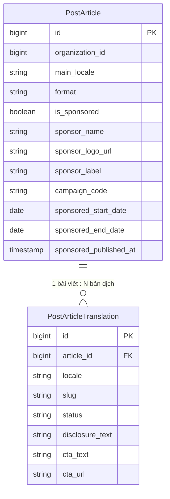
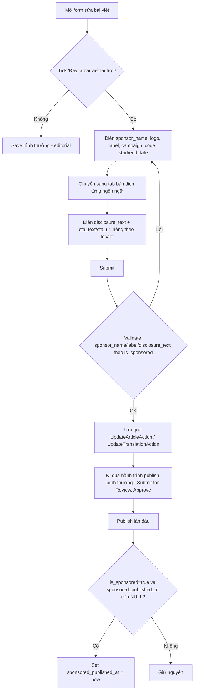
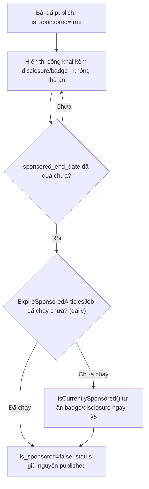

# Đặc tả kỹ thuật
## Module: Bài viết Tài trợ (Sponsored Content) — mở rộng `Modules/Post`

**Phiên bản:** 2.8 (hợp nhất với codebase thật + `spec/PublishingEngine_Technical_Specification.md`)
**Ngày:** 11/07/2026
**Framework:** Laravel 13 (PHP 8.4) + NWIDART Modules + Lorisleiva Actions
**Hệ thống:** Nền tảng multi-tenant (Organization-scoped)
**Module liên quan:** `Modules/Post` (đã tồn tại, đã đa ngôn ngữ hoá — xem `docs/post-module-spec.md` + `spec/PublishingEngine_Technical_Specification.md`)

> **v2.0 thay đổi so với v1.0**: v1.0 là bản đặc tả generic, viết độc lập không đối chiếu codebase — giả định `posts`/`articles` là 1 bảng phẳng duy nhất (title/slug/status/nội dung nằm chung), dùng pseudocode Python/Django-style và REST API `/api/articles/*` không tồn tại trong hệ thống này. Từ Publishing Engine (đã triển khai xong Phase 12-16), `post_articles` đã tách thành "vỏ" dùng chung mọi ngôn ngữ + `post_article_translations` per-locale (title/slug/status/excerpt/seo_*/published_at đều nằm ở translation, không phải article). Bản v2.0 chốt lại toàn bộ data model/state machine/actions cho đúng kiến trúc AVSA + CQRS-lite + Laravel Actions + multi-tenant + đa ngôn ngữ đang chạy thật, không đổi mục tiêu nghiệp vụ của v1.0 (§1, §5 user flow, §4.3 quy tắc hiển thị vẫn giữ nguyên tinh thần).
>
> **v2.1 sửa theo review**: (1) §6.2 — làm rõ validation chéo `disclosure_text` đi qua đúng pattern controller-validate đã có sẵn (giống slug uniqueness ở Publishing Engine §7.7), không cần Data subclass/FormRequest riêng; (2) §8 — job hết hạn bọc try-catch từng dòng + log lỗi, không để 1 tổ chức lỗi làm hỏng cả job (và ghi chú áp dụng ngược lại cho `PublishDueTranslationsJob`); (3) §3 — làm rõ soft-delete không cần xử lý gì thêm + xác nhận không có dữ liệu `sponsor_*` cũ cần backfill; (4) §5 — xác nhận rõ `SponsorLabel` chỉ cast ở `PostArticle`, cố tình không có trên translation; (5) §12 — thêm guard `$translation->disclosure_text` phòng dữ liệu thiếu dù validation đã chặn ở tầng nhập liệu.
>
> **v2.2 sửa theo review (mức thấp→trung bình)**: (1) §6.2 — thêm comment giải thích lý do dùng closure cho `Rule::requiredIf()`; (2) §8 — job hết hạn chạy trên queue `low` (đã có sẵn trong lệnh worker chuẩn của hệ thống, xem README) để không tranh tài nguyên với queue `default`/`high`; (3) §7.3 — xác nhận `sponsored_published_at` là mốc bất biến "lần đầu tiên", không có action "reset" (per-campaign timing dùng field khác, xem §7.3); (4) §7.5 mới — cache busting: chưa áp dụng vì hệ thống chưa có tầng cache (giữ nguyên quyết định Publishing Engine §7.5), ghi chú rõ chỗ cần bổ sung nếu sau này có cache; (5) §6.3 mới — Factory cho test; (6) §11 — ghi chú template disclosure có thể cấu hình qua Settings sau này; (7) §14 — thêm test case xác nhận không có cache (đọc dữ liệu mới nhất mọi lúc).
>
> **v2.3 sửa theo review (cosmetic/low priority)**: (1) §2 — thêm Mermaid ERD + User Flow diagram cho trực quan; (2) §4 — đã kiểm tra `SponsorLabel::label()` dùng `trans()` theo đề xuất review, nhưng xác nhận **giữ nguyên hard-code** vì cả 7 enum `label()` khác trong `Modules/Post` đều hard-code, không module nào trong codebase có `lang/` — đổi riêng 1 enum sẽ phá vỡ tính nhất quán, xem lý do đầy đủ ở §4; (3) §6.3 — Factory viết đầy đủ `definition()` + quan hệ `translation()` thay vì chỉ có state `sponsored()`; (4) §12/§13 — thêm mục Security note riêng (escape output, `rel="sponsored nofollow"`, sanitize nếu cho phép HTML sau này); (5) thêm mục 16 mới "Known Limitations / Future" ở cuối file.
>
> **v2.4 — sửa 3 lỗi thật phát hiện khi đối chiếu code thật trước khi implement (không phải góp ý phong cách)**: (1) §6.2 — `TranslationController::validated()` thực tế KHÔNG có tham số `$article` (đã đọc trực tiếp file), closure ở v2.1-v2.3 tham chiếu `$article` sẽ lỗi "undefined variable" khi tạo bản dịch đầu tiên cho bài mới; đã sửa signature + call site; (2) §6.1/§10 — đã đọc `ArticleData`/`TranslationData` thật: TOÀN BỘ codebase gọi `Data::from()`, KHÔNG bao giờ gọi `Data::validate()`, nên attribute Spatie Data (`RequiredIf`, `AfterOrEqual`) trên DTO **không có tác dụng validate thật** (`ArticleData` hiện có 0 attribute dù nhiều field bắt buộc, `TranslationData::title` có `#[Required]` nhưng cũng không được thực thi) — chuyển toàn bộ rule bắt buộc-có-điều-kiện sang rule string Laravel thuần trong `ArticleAdminController::validated()`, đúng cách mọi field khác trong đúng method đó đang được validate; (3) §5 — `isCurrentlySponsored()` bổ sung check `sponsored_end_date` (trước đây chỉ check `start_date`, để badge/disclosure có thể hiện trễ tới 24h sau khi hết hạn do phụ thuộc hoàn toàn vào job chạy daily).
>
> **v2.5 sửa theo review (cosmetic/low priority)**: (1) §4 — thêm comment giải thích quyết định hard-code `SponsorLabel::label()` chỉ đổi đồng loạt cùng 7 enum khác, không lẻ tẻ; (2) §6.2 — bổ sung rule `url`/`max` cho `cta_text`/`cta_url` thẳng vào code mẫu `TranslationController::validated()` (trước đây chỉ ghi chú bằng lời ở §12.1, chưa vào code); (3) §6.3 — thêm state `sponsoredAndPublished()` cho `PostArticleFactory`, rút gọn dựng dữ liệu test case #6/#10; (4) §2.1 — tách Mermaid User Flow dài thành 2 diagram ngắn hơn (luồng tác nghiệp + luồng vòng đời sau publish); (5) §16 — đưa câu "chỉ hỗ trợ 1 sponsor/bài" lên đầu bullet cho rõ ràng hơn.
>
> **v2.6 sửa theo review (cosmetic, không ảnh hưởng triển khai)**: (1) §6.3 — thêm state `sponsoredAndExpired()` cho `PostArticleFactory`, rút gọn thêm 1 dòng cho đúng test case #6/#10; (2) §12.1 — cân nhắc `active_url` cho `cta_url` theo đề xuất review nhưng **quyết định KHÔNG thêm** — rule này chạy DNS lookup đồng bộ (`checkdnsrr()`) ngay trong request validate, đổi lấy rủi ro thấp (field do Marketing/Editor nội bộ tự nhập, không phải input công khai) lấy rủi ro treo/timeout request khi DNS domain sponsor chậm — ngược tinh thần hiệu suất §13, xem lý do đầy đủ ở §12.1; (3) diagram (b) và bullet "không track CTA click-through" ở §16 — đã đạt yêu cầu, không cần sửa thêm (bullet CTA click-through đã có sẵn từ v2.3, không phải thiếu sót).
>
> **v2.7 — sửa lỗi thật phát hiện khi code Phase B/C thật (không phải review)**: (1) §8 — `public string $queue = 'low';` trên `ExpireSponsoredArticlesJob` gây fatal error thật khi chạy ("`ExpireSponsoredArticlesJob` and `Illuminate\Bus\Queueable` define the same property (`$queue`)... definition differs") vì trait `Queueable` đã khai `public $queue;` không type/không default — sửa bằng cách bỏ hẳn property, truyền `'low'` qua tham số thứ 2 của `Schedule::job($job, $queue)` khi đăng ký lịch thay vào đó; (2) §6.3 — `PostArticleFactory::definition()` bỏ default `Organization::factory()` cho `organization_id` vì gọi nó throw "Class not found" thật (bug tồn tại sẵn ở `App\Shared\Tenancy\Models\Organization`, model này không có `newFactory()` override và namespace không khớp quy ước đoán mặc định của Laravel) — ngoài phạm vi module Post nên không sửa `Organization`, chỉ bỏ default và yêu cầu luôn truyền `organization_id` tường minh (đúng cách mọi ví dụ dùng factory trong tài liệu này đã làm); (3) §10 — bổ sung rõ: `ArticleAdminController::store()`/`update()` phải tự thêm `abort_unless(can('post_article.manage_sponsorship'))` khi `is_sponsored` được bật hoặc bài đang sponsored bị đổi — §9/§10 bản trước chỉ định nghĩa Policy method và route `remove-sponsor`, chưa nói rõ chỗ gate này cần nằm ở `store()`/`update()` để test §14 mục 8 pass thật (nếu không có, user chỉ cần `post_article.edit` là bật được `is_sponsored=true` qua form thường, bỏ qua permission riêng).
>
> **v2.8 — sửa lỗi thật phát hiện khi chạy end-to-end test toàn bộ 5 phase (không phải review)**: (1) §7 — `CreateTranslationAction`/`UpdateTranslationAction` (đã code ở Phase B) **không thực sự ghi `disclosure_text`/`cta_text`/`cta_url`** vào `PostArticleTranslation::create()/update()` — §6.2/§10 đã đặc tả đúng validation cho 3 field này, nhưng §7 chỉ nói chung chung "mở rộng danh sách field ghi vào... PostArticleTranslation tương ứng" mà không liệt kê cụ thể 2 Action này, nên lúc code thật đã bỏ sót — chỉ phát hiện khi test toàn bộ luồng thật (tạo bài → tạo bản dịch qua Action → publish → xem trang công khai), không phải khi test riêng từng phase (Phase B trước đó test validation qua `TranslationController::validated()` trực tiếp và tạo dữ liệu test bằng `$article->translations()->create([...])` thủ công có sẵn `disclosure_text`, không đi qua chính Action nên không lộ ra); (2) phát hiện thêm 1 bug thật **NGOÀI PHẠM VI** module này, đã xin phép và sửa luôn theo yêu cầu người dùng (không phải việc bắt buộc của đặc tả này, ghi nhận lại để rõ nguồn gốc thay đổi): `PostArticlePolicy::update()`/`delete()` (Publishing Engine Phase 13, `submitForReview()` gọi qua `update()`) đọc `$translation->article->created_by` mà không đảm bảo quan hệ `article` đã được load — với 1 số kiểu hydrate cụ thể (vd bài có ≥2 bản dịch, `$article->translation($locale)` trả về từ collection đã eager-load `translations` nhưng KHÔNG có inverse `article`), điều này ném `LazyLoadingViolationException` thật (`Model::shouldBeStrict()` bật ở môi trường non-production) ngay khi Blade `@can('submitForReview', $translation)` được đánh giá trên trang edit — lỗi này xảy ra với BẤT KỲ bài đa bản dịch nào, không liên quan gì đến sponsorship. Đã sửa bằng `$translation->loadMissing('article')` đầu 2 method này (giống pattern đã dùng ở `ListRunnableWorkflowsHandler`), verify lại bằng đúng kịch bản E2E đã tái hiện lỗi — pass, không cần workaround `preventLazyLoading(false)` nữa.

---

## 0. Quyết định đã chốt (thay thế phần tương ứng của v1.0)

| Chủ đề | v1.0 nói gì | Quyết định v2.0 | Lý do |
|---|---|---|---|
| **Bảng lưu trữ** | "Thêm cột vào bảng `posts`/`articles`" (1 bảng phẳng) | Tách theo đúng ranh giới đã có: field **dùng chung mọi ngôn ngữ** → `post_articles`; field **hiển thị cho người đọc** (cần dịch) → `post_article_translations` | `post_articles` không còn cột nội dung nào từ Publishing Engine — thêm `disclosure_text` (câu chữ hiển thị) thẳng vào đó sẽ không dịch được, sai kiến trúc hiện tại |
| **`utm_params`** | Cột JSON, tự sinh nếu rỗng | **Không lưu** — tính động (accessor) từ `campaign_code`/`slug` mỗi lần cần dùng, không có cột nào cả | Nguyên tắc "No JSON storage" đã áp dụng xuyên suốt `Modules/Post` (`docs/post-module-spec.md` §4); công thức sinh UTM cố định 3 tham số, tính lúc render CTA rẻ hơn và luôn đồng bộ với `campaign_code` hiện tại (tránh lưu bản sao dễ lệch dữ liệu khi `campaign_code` đổi sau) |
| **`sponsor_label`** | `VARCHAR(50)/ENUM`, bắt buộc, thuộc 1 danh sách cho phép | PHP backed enum `SponsorLabel` (giống `TranslationStatus`/`ArticleFormat`), cột `string` trên **`post_articles`** (không phải translation) | Loại nhãn tài trợ (Sponsored/Advertorial/...) là thuộc tính của campaign, không đổi theo ngôn ngữ hiển thị trang — chỉ *tên hiển thị* của nhãn mới cần dịch, xử lý qua `label()` giống các enum khác trong module, không cần lưu chuỗi tự do |
| **State machine riêng cho Sponsored** | 5 trạng thái riêng: `draft(Sponsored)`, `pending_review(Sponsored)`, `published(Sponsored)`, `expired`, `archived` | **Không tạo state machine mới** — tái dùng nguyên `TranslationStatus` 7 trạng thái đã có. `is_sponsored` chỉ là 1 **thuộc tính** gắn thêm vào 1 translation đã đi qua đúng pipeline Draft→Submitted→Approved→Published/Scheduled | 2 state machine chạy song song trên cùng 1 bản ghi sẽ xung đột (bài đang "published" theo `TranslationStatus` nhưng "draft" theo state riêng là vô nghĩa); tái dùng giữ đúng nguyên tắc "1 nguồn sự thật" đã áp dụng cho publishing pipeline |
| **"Hết hạn tài trợ" (`expired`)** | Trạng thái mới HOẶC set `is_sponsored=false` — v1.0 để ngỏ ("tuỳ cấu hình") | **Chỉ set `is_sponsored=false`** — bài viết **giữ nguyên** `TranslationStatus::Published`, không tự động unpublish/archive | Hết hạn tài trợ ≠ nội dung xấu cần gỡ — bài có thể tiếp tục sống như bài editorial thường sau khi hết campaign. Muốn gỡ hẳn, biên tập viên tự bấm **Unpublish/Archive** (action đã có sẵn từ Publishing Engine), tách bạch 2 quyết định khác nhau |
| **Audit log** | `log_action("article_saved", ...)` / `log_action("sponsored_published", ...)` tự viết | **Không viết log riêng** — `PostArticle` đã kế thừa `TenantAwareModel` → tự động có `Spatie\Activitylog` (`logOnlyDirty()`) cho MỌI thay đổi field fillable, bao gồm các field sponsored mới. Riêng hành động "Publish" (đánh dấu `sponsored_published_at`) tái dùng `post_publishing_logs` + `LogsPublishingActions` đã có | Tránh viết 2 cơ chế audit song song; activity log đã bắt đúng yêu cầu §8 v1.0 ("mọi thay đổi phải log ai/lúc nào/đổi gì") miễn phí, không cần thêm cột/bảng |
| **Backend logic (pseudocode)** | Hàm tự do `save_article()`/`publish_article()`/`expire_sponsored_articles()`, Django ORM | Map 1-1 vào Action + Job theo đúng pattern Lorisleiva Actions đã dùng toàn bộ module (xem §7, §8) | Giữ nhất quán AVSA — không có "hàm nghiệp vụ tự do" nằm ngoài Actions/Jobs trong `Modules/Post` |
| **REST API** | `POST /api/articles`, `PUT /api/articles/{id}`, `/api/articles/{id}/remove-sponsor`... | **Không có** — dùng route admin nội bộ đã có (`dashboard/posts/articles/*`, `dashboard/posts/translations/*`), thêm 1 route mới `POST translations/{translation}/remove-sponsor` | Hệ thống không có REST API công khai cho Post; toàn bộ thao tác đi qua `ArticleAdminController`/`TranslationController` (session/CSRF, không phải token API) |
| **Hiển thị công khai** | Không đề cập gắn với route/view cụ thể | Gắn vào `Modules/Post/resources/views/public/article.blade.php` (Phase 16 — đã triển khai) | Trang công khai đã tồn tại thật, chỉ cần chèn block disclosure/label vào đúng vị trí |

---

## 1. Mục tiêu (giữ nguyên v1.0)

Cho phép Marketing/Editor:
- Đánh dấu 1 bài viết (1 `PostArticle`, áp dụng cho mọi bản dịch) là **tài trợ bởi 1 thương hiệu/campaign**.
- Mỗi bản dịch (`PostArticleTranslation`) tự viết **disclosure text + CTA riêng** theo ngôn ngữ của mình.
- Gắn nhãn & disclosure **không thể ẩn** ở trang công khai.
- Tự động hết hạn theo lịch, không cần thao tác tay.
- Phân biệt rõ với nội dung editorial thường (badge riêng trong admin UI).

---

## 2. Kiến trúc dữ liệu — ERD

```
PostArticle (đã có — thêm cột mới)
  ├─ ...(các cột hiện có: uuid, organization_id, main_locale, format, cover_image_url,
  │    is_featured, sort_order, created_by, updated_by, timestamps, soft delete)
  ├─ is_sponsored            BOOLEAN, default false
  ├─ sponsor_name            VARCHAR(255), nullable
  ├─ sponsor_logo_url        VARCHAR(500), nullable
  ├─ sponsor_label           VARCHAR(30), nullable — SponsorLabel enum value
  ├─ campaign_code           VARCHAR(50), nullable
  ├─ sponsored_start_date    DATE, nullable
  ├─ sponsored_end_date      DATE, nullable
  └─ sponsored_published_at  TIMESTAMP, nullable — set 1 lần, lần đầu publish khi is_sponsored=true

PostArticleTranslation (đã có — thêm cột mới, PER-LOCALE)
  ├─ ...(title, slug, excerpt, status, published_at, seo_*, đã có)
  ├─ disclosure_text  VARCHAR(500), nullable — câu công bố tài trợ theo đúng ngôn ngữ bản dịch
  ├─ cta_text         VARCHAR(100), nullable
  └─ cta_url          VARCHAR(500), nullable
```

Không có bảng mới. `utm_params` **không lưu** — tính động qua `PostArticle::sponsoredUtmParams(): array` (xem §5).


Field `is_sponsored`/`sponsor_*`/`campaign_code`/`sponsored_*` nằm ở **PostArticle** (dùng chung mọi bản dịch); `disclosure_text`/`cta_*` nằm ở **PostArticleTranslation** (per-locale) — đúng ranh giới đã chốt ở §0.

### 2.1 User Flow — tách 2 diagram ngắn (v2.5, bản gộp cũ dài khi in)

**(a) Luồng tác nghiệp — Marketing/Editor gắn tài trợ cho 1 bài, tới lúc publish lần đầu:**



**(b) Luồng vòng đời sau publish — hiển thị công khai tới lúc hết hạn:**



---

## 3. Migrations

Cả 2 migration đều **thuần cộng thêm cột nullable/default** — không đụng dữ liệu cũ, không cần tách nhiều bước như Publishing Engine (không có schema cũ cần backfill, `is_sponsored` mặc định `false` cho mọi bài hiện có).

### 3.1 `..._add_sponsorship_fields_to_post_articles_table.php`

```php
Schema::table('post_articles', function (Blueprint $table) {
    $table->boolean('is_sponsored')->default(false)->after('is_featured');
    $table->string('sponsor_name', 255)->nullable()->after('is_sponsored');
    $table->string('sponsor_logo_url', 500)->nullable()->after('sponsor_name');
    $table->string('sponsor_label', 30)->nullable()->after('sponsor_logo_url');
    $table->string('campaign_code', 50)->nullable()->after('sponsor_label');
    $table->date('sponsored_start_date')->nullable()->after('campaign_code');
    $table->date('sponsored_end_date')->nullable()->after('sponsored_start_date');
    $table->timestamp('sponsored_published_at')->nullable()->after('sponsored_end_date');

    // §13 hiệu suất — job hết hạn (chạy mỗi ngày) + màn hình danh sách lọc "chỉ bài tài trợ"
    // đều query theo is_sponsored + sponsored_end_date, cần composite index.
    $table->index(['organization_id', 'is_sponsored', 'sponsored_end_date'], 'idx_post_article_sponsored');
});
```

### 3.2 `..._add_sponsorship_fields_to_post_article_translations_table.php`

```php
Schema::table('post_article_translations', function (Blueprint $table) {
    $table->string('disclosure_text', 500)->nullable()->after('excerpt');
    $table->string('cta_text', 100)->nullable()->after('disclosure_text');
    $table->string('cta_url', 500)->nullable()->after('cta_text');
});
```

Không cần index riêng cho 2 bảng con — không có truy vấn lọc theo các cột này ở quy mô lớn (đọc kèm theo `article_id`/`locale` đã có index sẵn).

### 3.3 Backfill & soft-delete (review hỏi)

- **Không cần backfill**: đã grep toàn bộ codebase trước khi viết bản v2.0 — không có bất kỳ field `sponsor_*`/`is_sponsored`/`disclosure_text` nào tồn tại từ trước (kể cả nhập tay hay cột đặt tên khác). 2 migration ở §3.1/§3.2 là cộng cột nullable/default thuần tuý, mọi bài viết hiện có tự động có `is_sponsored=false` sau migrate, không cần bước chuyển dữ liệu nào.
- **Soft-delete**: `PostArticle` đã `SoftDeletes` (qua `TenantAwareModel`). Xoá mềm 1 bài `is_sponsored=true` **không cần xử lý gì thêm** — field sponsor giữ nguyên trên bản ghi đã xoá mềm (nhất quán với cách toàn bộ field khác của `PostArticle` hoạt động khi xoá mềm, không có ngoại lệ riêng cho sponsored). Nếu bài được khôi phục (`restore()`), trạng thái tài trợ tự động khôi phục nguyên vẹn theo đúng field đã lưu — đúng hành vi mong đợi. `ExpireSponsoredArticlesJob` (§8) dùng `PostArticle::withoutTenant()->where(...)` — Eloquent tự động loại trừ bản ghi đã xoá mềm theo `SoftDeletes` global scope mặc định, không cần thêm `whereNull('deleted_at')` thủ công.

---

## 4. Enum

```php
// Modules/Post/app/Enums/SponsorLabel.php
enum SponsorLabel: string
{
    case Sponsored          = 'sponsored';
    case SponsoredNews      = 'sponsored_news';
    case BrandPartnership   = 'brand_partnership';
    case Advertorial        = 'advertorial';

    // Hard-code có chủ đích (xem lý do đầy đủ bên dưới code block) — nếu sau này toàn bộ 8 enum
    // label() trong Modules/Post chuyển sang trans(), enum này cập nhật ĐỒNG LOẠT cùng lúc,
    // không sửa lẻ tẻ riêng SponsorLabel khi có tính năng mới.
    public function label(): string
    {
        return match ($this) {
            self::Sponsored        => 'Sponsored',
            self::SponsoredNews    => 'Tin tài trợ',
            self::BrandPartnership => 'Hợp tác thương hiệu',
            self::Advertorial      => 'Advertorial',
        };
    }

    public function badgeClass(): string
    {
        return 'badge-warning'; // 1 màu thống nhất — không cần phân biệt màu theo loại nhãn
    }
}
```

**Đã kiểm tra lại (review đề xuất `trans()` — quyết định: KHÔNG áp dụng)**: đã grep toàn bộ `Modules/*` — **không có module nào trong toàn bộ codebase có thư mục `lang/`**, và cả 7 enum `label()` khác đang tồn tại trong chính `Modules/Post` (`TranslationStatus`, `ArticleFormat`, `ArticleStatus`, `ContentBlockType`, `ProductBlockTemplate`, `ButtonStyle`, `ButtonTarget`, `ButtonUrlType`) đều hard-code chuỗi tiếng Việt y hệt cách `SponsorLabel` đang làm. Đổi riêng `SponsorLabel` sang `trans("post::sponsor_label.{$this->value}")` sẽ tạo ra **1 enum duy nhất khác cách toàn bộ 7 enum còn lại** trong cùng module — vi phạm chính nguyên tắc nhất quán mà bản đặc tả này theo đuổi xuyên suốt (§0, §7.3...), và kéo theo hạ tầng mới hoàn toàn chưa từng có (`lang/` publish trong NWIDART module, đăng ký namespace `post::`) chỉ để phục vụ 1 enum. Giữ nguyên `match` hard-code — nếu sau này có nhu cầu **thật** đa ngôn ngữ hoá UI admin (không chỉ nội dung bài viết, mà cả chữ trong chính giao diện), đó là quyết định áp dụng cho **toàn bộ 8 enum cùng lúc** (1 lần dọn dẹp có chủ đích), không phải sửa lẻ tẻ từng enum khi thêm tính năng mới.

---

## 5. Model — bổ sung `PostArticle`

```php
protected $fillable = [
    // ...(đã có)
    'is_sponsored', 'sponsor_name', 'sponsor_logo_url', 'sponsor_label',
    'campaign_code', 'sponsored_start_date', 'sponsored_end_date', 'sponsored_published_at',
];

protected $casts = [
    // ...(đã có)
    'is_sponsored'           => 'boolean',
    'sponsor_label'          => SponsorLabel::class,
    'sponsored_start_date'   => 'date',
    'sponsored_end_date'     => 'date',
    'sponsored_published_at' => 'datetime',
];

/** §4.2 v1.0 — utm_params không lưu, tính động lúc cần (render CTA / redirect click). */
public function sponsoredUtmParams(): array
{
    return [
        'utm_source'   => 'sponsored',
        'utm_medium'   => 'article',
        'utm_campaign' => $this->campaign_code ?: $this->mainTranslation()?->slug,
    ];
}

/**
 * Điều kiện hiển thị badge/disclosure. Check CẢ start_date lẫn end_date tại đây — không chỉ dựa
 * vào is_sponsored bị ExpireSponsoredArticlesJob (§8) tắt, vì job chỉ chạy 1 lần/ngày (daily,
 * không phải everyMinute — §13) nên is_sponsored có thể còn true tới ~24h SAU khi
 * sponsored_end_date đã qua. Kiểm tra end_date trực tiếp ở đây giúp trang công khai ẩn badge
 * NGAY khi qua ngày hết hạn, không phải đợi job chạy — job vẫn cần thiết để dọn is_sponsored
 * về false cho báo cáo/danh sách lọc (§13), nhưng không còn là nguồn sự thật DUY NHẤT cho hiển
 * thị (phát hiện khi đối chiếu code thật — v2.4, review trước đó không phát hiện gap này).
 */
public function isCurrentlySponsored(): bool
{
    if (! $this->is_sponsored) {
        return false;
    }

    $today = now()->toDateString();

    if ($this->sponsored_start_date && $this->sponsored_start_date->toDateString() > $today) {
        return false; // chưa tới ngày bắt đầu hiển thị label
    }

    if ($this->sponsored_end_date && $this->sponsored_end_date->toDateString() < $today) {
        return false; // đã qua ngày hết hạn — ẩn ngay, không đợi ExpireSponsoredArticlesJob
    }

    return true;
}
```

`PostArticleTranslation` chỉ cần thêm 3 field vào `$fillable` (`disclosure_text`, `cta_text`, `cta_url`) — không cần cast đặc biệt (string thường).

**Xác nhận rõ (review hỏi)**: `SponsorLabel` **cố tình chỉ cast ở `PostArticle`**, không thêm cast/cột nào cho nó ở `PostArticleTranslation` — đúng quyết định §0 ("nhãn tài trợ là thuộc tính campaign, không đổi theo ngôn ngữ"). Nếu sau này có yêu cầu thật cần TÊN NHÃN hiển thị khác nhau tuỳ ngôn ngữ (khác với chỉ dịch qua `label()`), đó là thay đổi kiến trúc cần quay lại §0 chốt lại, không phải thiếu sót ở bản này.

---

## 6. Validation — mở rộng `ArticleData` / `TranslationData`

### 6.1 `ArticleData` (field dùng chung — §3 v1.0 các cột thuộc `post_articles`)

```php
public function __construct(
    // ...(field đã có: format, cover_image_url, is_featured, main_locale, category_ids, ...)

    public readonly bool $is_sponsored = false,
    public readonly ?string $sponsor_name = null,
    public readonly ?string $sponsor_logo_url = null,
    public readonly ?SponsorLabel $sponsor_label = null,
    public readonly ?string $campaign_code = null,
    public readonly ?string $sponsored_start_date = null,
    public readonly ?string $sponsored_end_date = null,
) {}
```

**Sửa quan trọng (v2.4 — phát hiện khi đọc code thật, không phải chỉ đọc theo lý thuyết Spatie Data)**: bản v2.0-v2.3 trước đó đặt `#[RequiredIf('is_sponsored', true)]`/`#[AfterOrEqual('sponsored_start_date')]` trực tiếp lên các field này, giả định Spatie Data tự validate khi hydrate. **Sai** — đã đọc `ArticleAdminController::store()`/`update()`: cả 2 đều gọi `ArticleData::from($this->validated($request))`, tức là `Data::from()`, KHÔNG BAO GIỜ gọi `Data::validate()`/`Data::validateAndCreate()`. Trong Spatie Laravel Data, `::from()` chỉ hydrate (gán giá trị vào readonly property), các attribute validation chỉ được thực thi khi gọi `::validate()` hoặc khi Data class được auto-resolve trực tiếp làm type-hint tham số route (cả 2 cách này **không được dùng ở bất kỳ đâu** trong `Modules/Post` hiện tại). Bằng chứng cụ thể: `ArticleData` hiện tại (trước bản đặc tả này) có **0 validation attribute** dù có field bắt buộc thật ở tầng DB (`format` NOT NULL) — vì việc validate `format` đã và đang nằm 100% ở `ArticleAdminController::validated()`'s `$request->validate([...])` (native Laravel rule), không phải ở DTO. Thêm attribute lên `ArticleData` cho field sponsorship sẽ tạo ra code trông như có validate nhưng thực chất là tử code (dead code) — im lặng không chặn gì cả, nguy hiểm hơn cả việc không viết gì vì đánh lừa người đọc sau này.

→ **Quyết định đúng**: `ArticleData` chỉ là DTO hydrate thuần (như hiện tại), không mang attribute validate nào cho field mới — validate 100% chuyển sang native Laravel rule string trong `ArticleAdminController::validated()` (§10), đúng y cách `format`/`category_ids`/mọi field khác của chính `ArticleData` đang được validate hôm nay.

### 6.2 `TranslationData` (field per-locale) — validation chéo với `ArticleData`

```php
public readonly ?string $disclosure_text = null, // required-if khi article.is_sponsored — xem bên dưới
public readonly ?string $cta_text = null,
public readonly ?string $cta_url = null,
```

`disclosure_text` bắt buộc khi `is_sponsored=true`, nhưng `is_sponsored` nằm ở **`ArticleData` — 1 DTO khác** với `TranslationData`. Spatie Data không hỗ trợ điều kiện `#[RequiredIf]` tham chiếu chéo giữa 2 DTO khác nhau, nên **không** đặt attribute trên `TranslationData` cho field này.

**Quyết định (v2.1, sửa theo review)**: validate ngay trong `TranslationController::validated()` bằng `Rule::requiredIf()` đọc `$translation->article->is_sponsored` (route-model-bound sẵn khi update; khi tạo mới qua `articles/{article}/translations` thì đọc `is_sponsored` của `$article` truyền vào từ route param) — **đúng y pattern đã có sẵn** cho slug uniqueness ở Publishing Engine §7.7 ("Form Request/controller validate slug thủ công — Spatie Data không tự biết `$translation->id` hiện tại"). Đây là tiền lệ đã được chốt cho đúng loại vấn đề này (validation cần context runtime mà DTO không có), nên **không tạo `SponsoredTranslationData extends TranslationData` hay `FormRequest` riêng** — module này không dùng FormRequest ở bất kỳ đâu (toàn bộ controller dùng `$request->validate([...])` trực tiếp + Spatie Data cho phần còn lại), thêm 1 lớp trừu tượng mới chỉ cho 1 field sẽ phá vỡ tính nhất quán.

**Sửa lỗi thật (v2.4)**: đã đọc `TranslationController::validated()` hiện tại — signature là `validated(Request $request, ?PostArticleTranslation $translation, string $locale): array`, **KHÔNG có tham số `$article`**. Bản v2.1-v2.3 viết closure `fn () => ($translation?->article ?? $article)->is_sponsored` giả định biến `$article` có sẵn trong scope method — **sai**, biến này không tồn tại ở đó. `$article` chỉ có ở `store()` (nơi gọi `validated()`), phải truyền xuống rõ ràng. Cần sửa cả signature lẫn 2 call site:

```php
// TranslationController::store() — truyền thêm $article khi gọi validated()
$data = TranslationData::from($this->validated($request, null, $locale, $article));

// TranslationController::update() — $article luôn null, đã có $translation->article rồi
$data = TranslationData::from($this->validated($request, $translation, $translation->locale, null));

// TranslationController::validated() — thêm tham số thứ 4
private function validated(Request $request, ?PostArticleTranslation $translation, string $locale, ?PostArticle $article): array
{
    // ...(rule các field đã có, không đổi)

    'disclosure_text' => [
        // Dùng closure (không phải attribute #[RequiredIf] trên DTO) vì điều kiện nằm ở
        // ArticleData — 1 DTO KHÁC với TranslationData đang validate; Spatie Data không hỗ
        // trợ required-if tham chiếu chéo giữa 2 DTO. Rule::requiredIf() của Laravel không có
        // giới hạn này vì nó chạy ở tầng request, đọc được bất kỳ biến nào trong scope closure.
        // $translation->article dùng khi update (translation đã tồn tại); $article (tham số
        // mới truyền vào từ route) dùng khi tạo mới translation đầu tiên — 2 nguồn LOẠI TRỪ
        // NHAU (không bao giờ cả 2 cùng null hoặc cùng có giá trị).
        Rule::requiredIf(fn () => ($translation?->article ?? $article)->is_sponsored),
        'nullable', 'string', 'max:500',
    ],
    // v2.5 — trước đây §12.1 chỉ ghi chú bằng lời "nên thêm rule url", chưa đưa vào code thật.
    // Chặn javascript:/data: URI lọt qua nếu ai đó nhập tay field này qua request giả mạo (§12.1).
    'cta_text' => ['nullable', 'string', 'max:100'],
    'cta_url'  => ['nullable', 'url', 'max:500'],
```

### 6.3 Factory cho test (review chỉ ra: `Modules/Post` hiện chưa có model factory nào)

Đã grep xác nhận: không có `PostArticleFactory`/`PostArticleTranslationFactory` trong `Modules/Post/database/factories/` (thư mục này chưa tồn tại). Toàn bộ 8 test case ở §14 hiện phải dựng dữ liệu qua Action thật (`CreateArticleAction`/`CreateTranslationAction`) — đúng tinh thần "test qua Action, không qua ORM trực tiếp" nhưng chậm hơn cho các test không cần chạy full pipeline (vd chỉ cần 1 bài `is_sponsored=true` đã publish sẵn để test job hết hạn).

Khuyến nghị bổ sung khi vào Phase B/C (§15) — viết đủ `definition()` theo đúng field `$fillable` thật của 2 model (không phải stub), kèm `translation()` để tạo luôn 1 bản dịch mặc định (article "trần" không có bản dịch nào thì không test được hầu hết luồng §14):

```php
// Modules/Post/database/factories/PostArticleFactory.php
class PostArticleFactory extends Factory
{
    protected $model = PostArticle::class;

    public function definition(): array
    {
        return [
            'uuid'             => (string) Str::uuid(),
            'organization_id'  => Organization::factory(),
            'main_locale'      => 'vi',
            'format'           => ArticleFormat::Article,
            'cover_image_url'  => null,
            'is_featured'      => false,
            'sort_order'       => 0,
            'is_sponsored'     => false, // mặc định KHÔNG sponsored — đúng dữ liệu thật sau migrate
        ];
    }

    public function sponsored(): static
    {
        return $this->state(fn () => [
            'is_sponsored'         => true,
            'sponsor_name'         => fake()->company(),
            'sponsor_logo_url'     => fake()->imageUrl(),
            'sponsor_label'        => SponsorLabel::Sponsored,
            'campaign_code'        => strtoupper(fake()->bothify('CAMP-####')),
            'sponsored_start_date' => now()->subDay()->toDateString(),
            'sponsored_end_date'   => now()->addDays(30)->toDateString(),
        ]);
    }

    /** Tạo kèm 1 PostArticleTranslation mặc định — dùng `afterCreating`, không phải quan hệ has-one giả. */
    public function withTranslation(array $translationAttributes = []): static
    {
        return $this->afterCreating(function (PostArticle $article) use ($translationAttributes) {
            PostArticleTranslation::factory()
                ->for($article, 'article')
                ->create(array_merge(['organization_id' => $article->organization_id, 'locale' => $article->main_locale], $translationAttributes));
        });
    }

    /**
     * Gộp sponsored() + 1 translation đã published + disclosure_text hợp lệ + sponsored_published_at
     * đã set — dựng thẳng đúng trạng thái test case §14 mục 6 (job hết hạn) và mục 10
     * (isCurrentlySponsored() trước khi job chạy) cần, không phải ghép 3-4 state thủ công mỗi lần viết test.
     */
    public function sponsoredAndPublished(): static
    {
        return $this->sponsored()
            ->withTranslation([
                'status'       => TranslationStatus::Published,
                'published_at' => now()->subDay(),
            ])
            ->afterCreating(function (PostArticle $article) {
                $article->mainTranslation()?->update([
                    'disclosure_text' => "Nội dung tài trợ bởi {$article->sponsor_name}",
                ]);
                $article->update(['sponsored_published_at' => now()->subDay()]);
            });
    }

    /** sponsoredAndPublished() + sponsored_end_date đã qua hôm qua — đúng thẳng setup test case §14 mục 6/10. */
    public function sponsoredAndExpired(): static
    {
        return $this->sponsoredAndPublished()->state(fn () => [
            'sponsored_end_date' => now()->subDay()->toDateString(),
        ]);
    }
}

// Modules/Post/database/factories/PostArticleTranslationFactory.php
class PostArticleTranslationFactory extends Factory
{
    protected $model = PostArticleTranslation::class;

    public function definition(): array
    {
        $title = fake()->sentence();

        return [
            'uuid'    => (string) Str::uuid(),
            'locale'  => 'vi',
            'title'   => $title,
            'slug'    => Str::slug($title) . '-' . fake()->unique()->numberBetween(1000, 9999),
            'excerpt' => fake()->paragraph(),
            'status'  => TranslationStatus::Draft,
        ];
    }

    public function published(): static
    {
        return $this->state(fn () => ['status' => TranslationStatus::Published, 'published_at' => now()]);
    }

    /** Chỉ hợp lệ khi article cha có is_sponsored=true (đúng validation §6.2) — factory không tự bật is_sponsored hộ. */
    public function withDisclosure(string $sponsorName = 'Nhãn hàng ABC'): static
    {
        return $this->state(fn () => [
            'disclosure_text' => "Nội dung tài trợ bởi {$sponsorName}",
            'cta_text'        => 'Tìm hiểu thêm',
            'cta_url'         => 'https://example.com',
        ]);
    }
}
```
Chỉ dùng trong test (`database/factories`, không phải seeder demo) — `AicemDemoDataSeeder`/seeder demo dữ liệu mẫu cho môi trường dev là việc khác, không thuộc phạm vi factory này. Ví dụ dùng trong test case §14 mục 6/10 (job hết hạn / check hiển thị trước khi job chạy): `PostArticle::factory()->sponsoredAndExpired()->create()` — 1 dòng, không phải ghép `sponsored()->withTranslation()->...` thủ công mỗi lần viết test.

---

## 7. Actions

Không tạo Action hoàn toàn mới cho "lưu bài" — tái dùng đúng `CreateArticleAction`/`UpdateArticleAction` (field cấp-article) và `CreateTranslationAction`/`UpdateTranslationAction` (field per-locale) đã có, chỉ mở rộng danh sách field ghi vào `PostArticle::create()/update()` và `PostArticleTranslation` tương ứng — khớp đúng tinh thần "hàm save_article() chạy validation rồi lưu" của v1.0 §6, nhưng đi qua đúng Action đã tồn tại thay vì viết hàm mới.

**Cụ thể (v2.8 — tránh lặp lại lỗi bỏ sót thật đã gặp)**: `CreateTranslationAction`/`UpdateTranslationAction::handle()` PHẢI thêm `disclosure_text`/`cta_text`/`cta_url` vào mảng `PostArticleTranslation::create([...])`/`update([...])` — ngang hàng với `title`/`excerpt`/`seo_title` đã có, lấy trực tiếp từ `$data->disclosure_text`/`$data->cta_text`/`$data->cta_url` (không cần điều kiện `is_sponsored` ở tầng Action vì validate cross-DTO đã chặn ở §6.2, Action chỉ việc lưu nguyên giá trị đã validate).

### 7.1 `UpdateArticleAction` — bổ sung field sponsorship

```php
$article->update([
    // ...(field đã có)
    'is_sponsored'           => $data->is_sponsored,
    'sponsor_name'           => $data->is_sponsored ? $data->sponsor_name : null,
    'sponsor_logo_url'       => $data->is_sponsored ? $data->sponsor_logo_url : null,
    'sponsor_label'          => $data->is_sponsored ? $data->sponsor_label : null,
    'campaign_code'          => $data->is_sponsored ? $data->campaign_code : null,
    'sponsored_start_date'   => $data->is_sponsored ? $data->sponsored_start_date : null,
    'sponsored_end_date'     => $data->is_sponsored ? $data->sponsored_end_date : null,
]);
```
Đúng ghi chú §3 v1.0 ("Khi is_sponsored=false → mọi field sponsored phải được clear") — clear ngay tại Action, không cần Action "RemoveSponsorship" riêng cho trường hợp save thường; `CreateArticleAction` áp dụng y hệt logic này khi tạo mới.

### 7.2 `RemoveSponsorshipAction` (mới — action riêng cho nút "Gỡ tài trợ" §5 bước 6 v1.0)

Khác save thường ở chỗ: đây là **1 thao tác độc lập** (nút bấm riêng, không đi qua form save đầy đủ) và cần ghi log rõ ràng hơn 1 lượt "update thường".

```php
// Modules/Post/app/Features/ArticleAuthoring/Actions/RemoveSponsorshipAction.php
class RemoveSponsorshipAction
{
    use AsAction;

    public function handle(PostArticle $article): PostArticle
    {
        $article->update([
            'is_sponsored'         => false,
            'sponsor_name'         => null,
            'sponsor_logo_url'     => null,
            'sponsor_label'        => null,
            'campaign_code'        => null,
            'sponsored_start_date' => null,
            'sponsored_end_date'   => null,
            // sponsored_published_at CỐ TÌNH giữ nguyên — lịch sử "đã từng là bài tài trợ",
            // không xoá dấu vết dù đã gỡ (khác các field khác).
        ]);

        // Activity log tự động qua TenantAwareModel (logOnlyDirty) — không cần ghi log thủ công.

        return $article;
    }
}
```

### 7.3 Đánh dấu `sponsored_published_at` khi Publish lần đầu

*(Review xác nhận đặt ở cấp article là hợp lý cho yêu cầu hiện tại — "lần đầu publish khi is_sponsored=true", không phải "bản dịch nào publish đầu tiên". Nếu sau này có yêu cầu thật cần biết CHÍNH XÁC bản dịch nào publish đầu tiên dưới dạng sponsored, đó là mở rộng thêm 1 cột `first_sponsored_translation_id` hoặc đọc trực tiếp từ `post_publishing_logs`, không phải sửa lại quyết định này.)*

`PublishArticleAction` (đã có, Publishing Engine) mở rộng thêm 1 bước — set `sponsored_published_at` trên **PostArticle** (không phải translation) nếu đây là bản dịch **đầu tiên** của bài được publish trong lúc `is_sponsored=true`:

```php
public function handle(PostArticleTranslation $translation): PostArticleTranslation
{
    // ...(logic canTransitionTo + update status đã có, không đổi)

    $article = $translation->article;
    if ($article->is_sponsored && ! $article->sponsored_published_at) {
        $article->update(['sponsored_published_at' => now()]);
    }

    $this->log($translation, 'publish'); // đã có — không cần action string riêng
                                          // "sponsored_published" như v1.0 đề xuất, vì
                                          // sponsored_published_at + activity log trên
                                          // PostArticle đã đủ truy vết, tránh 2 nguồn log
                                          // cho cùng 1 sự kiện.

    event(new ArticlePublished($translation));

    return $translation;
}
```

**Không có action "reset" `sponsored_published_at` (review hỏi)**: đây là quyết định cố ý, không phải thiếu sót. Theo đúng nghĩa đen §0/v1.0 ("lần đầu publish khi is_sponsored=true"), field này là mốc lịch sử **bất biến** — kể cả khi Marketing gỡ tài trợ (§7.2) rồi bật lại `is_sponsored=true` và publish 1 campaign hoàn toàn mới, `sponsored_published_at` vẫn giữ giá trị lần đầu tiên, không có nút/action nào ghi đè nó. Nếu nghiệp vụ sau này cần theo dõi **thời điểm publish của từng đợt campaign** (không phải "lần đầu tiên duy nhất"), đó là nhu cầu khác — đã có sẵn 2 cách giải quyết không cần đổi field này: (1) `sponsored_start_date`/`campaign_code` (§2) đổi mỗi lần bật lại tài trợ, tự nhiên phản ánh mốc thời gian của campaign hiện tại; (2) `post_publishing_logs` (đã có, dùng chung Publishing Engine) ghi lại mọi lượt publish thật theo timestamp, không giới hạn "lần đầu" — đọc từ đây nếu cần lịch sử đầy đủ. Không mở rộng thêm cột/action chỉ để phục vụ 1 nhu cầu giả định chưa có yêu cầu thật.

### 7.4 Cache busting (forward-looking — review hỏi)

Hệ thống **hiện chưa có tầng cache** cho trang công khai (đúng quyết định Publishing Engine §7.5, giữ nguyên ở §13 bảng hiệu suất bên dưới) — nên **không có gì để "bust" ở bản này**. Mọi thay đổi `sponsor_name`/`sponsor_label`/`disclosure_text`... hiển thị ngay lập tức ở lần request tiếp theo vì `PublicArticleController` đọc thẳng từ DB mỗi lần, không qua bất kỳ lớp cache nào (xác nhận bằng test case §14 mục 9 mới).

Ghi chú cho tương lai (không phải việc cần làm ở module này): nếu sau này `Modules/Post` thêm cache cho trang công khai (vd Redis cache theo `translation->slug`), các field sponsorship ở đây **bắt buộc phải nằm trong cùng 1 khoá cache** với field nội dung translation khác (title/excerpt/seo_*) — không tách cache riêng cho sponsorship, vì cả 2 nhóm field cùng invalidate tại đúng 1 sự kiện (translation được update) nên tách ra chỉ tạo thêm 1 chỗ có thể quên invalidate.

---

## 8. Job hết hạn — `ExpireSponsoredArticlesJob`

Đúng pattern `PublishDueTranslationsJob` (Publishing Engine Phase 14) — job hệ thống, không thuộc 1 tenant cụ thể, `withoutTenant()` khi đọc + restore đúng `TenantContext` từng dòng trước khi ghi/gửi notification.

```php
// Modules/Post/app/Jobs/ExpireSponsoredArticlesJob.php
class ExpireSponsoredArticlesJob implements ShouldQueue
{
    use Dispatchable, InteractsWithQueue, Queueable, SerializesModels;

    // Queue 'low' được set khi ĐĂNG KÝ lịch (PostServiceProvider::boot(), tham số thứ 2 của
    // Schedule::job() — xem bên dưới), KHÔNG khai property $queue trong class này. Đã thử khai
    // `public string $queue = 'low';` khi code thật (v2.6) — gặp fatal error thật lúc chạy:
    // "ExpireSponsoredArticlesJob and Illuminate\Bus\Queueable define the same property ($queue)
    // ... definition differs and is considered incompatible", vì trait Queueable đã khai
    // `public $queue;` (không type, không default) — khai lại cùng tên với type/default khác vi
    // phạm quy tắc composition property của PHP trait. Sửa bằng cách truyền queue qua tham số
    // Schedule::job($job, $queue) thay vì qua property.
    public function handle(): void
    {
        PostArticle::withoutTenant()
            ->where('is_sponsored', true)
            ->whereNotNull('sponsored_end_date')
            ->where('sponsored_end_date', '<', now()->toDateString())
            ->chunkById(100, function ($articles) {
                foreach ($articles as $article) {
                    // Cô lập lỗi TỪNG bài — 1 tổ chức/bài lỗi (vd Organization vừa bị xoá cứng
                    // giữa lúc job chạy, notification gửi thất bại...) không được làm hỏng cả
                    // chunk/job, các bài còn lại vẫn phải được xử lý (review đã chỉ ra thiếu sót
                    // này — áp dụng NGƯỢC LẠI cho PublishDueTranslationsJob cũng hợp lý nếu sửa sau).
                    try {
                        $org = Organization::withoutGlobalScopes()->find($article->organization_id);
                        if (! $org) {
                            continue;
                        }

                        TenantContext::runForOrganization($org, function () use ($article) {
                            // §0 — CHỈ tắt is_sponsored, KHÔNG đổi TranslationStatus/unpublish.
                            $article->update(['is_sponsored' => false]);

                            $this->notifyExpired($article);
                        });
                    } catch (\Throwable $e) {
                        Log::error('ExpireSponsoredArticlesJob: lỗi xử lý article', [
                            'article_id' => $article->id,
                            'organization_id' => $article->organization_id,
                            'exception' => $e->getMessage(),
                        ]);
                        // Không rethrow — tiếp tục với bài tiếp theo trong chunk. Bài lỗi vẫn còn
                        // is_sponsored=true + sponsored_end_date cũ nên lần chạy job KẾ TIẾP (ngày
                        // mai) sẽ tự động thử lại, không cần cơ chế retry riêng.
                    }
                }
            });
    }

    private function notifyExpired(PostArticle $article): void
    {
        $editors = User::where('organization_id', $article->organization_id)
            ->role(['marketing', 'ceo'])
            ->get();

        if ($editors->isNotEmpty()) {
            Notification::send($editors, new SponsorshipExpiredNotification($article));
        }
    }
}
```

Đăng ký trong `PostServiceProvider::boot()` cùng chỗ `PublishDueTranslationsJob`:
```php
$schedule->job(new ExpireSponsoredArticlesJob(), 'low')->daily()->withoutOverlapping();
```
Chạy **daily** (không cần everyMinute như publish-due) — hết hạn tài trợ tính theo `date` (không theo giờ), chạy 1 lần/ngày đủ chính xác và giảm tải queue đáng kể so với chạy mỗi phút (§13).

`SponsorshipExpiredNotification` viết theo đúng khuôn `ArticleTakenDownNotification` (`RespectsNotificationPreferences`, `NotificationData::make(...)`), không lặp lại ở đây.

---

## 9. Policy & Permission

```php
// app/Enums/PermissionEnum.php
case POST_ARTICLE_MANAGE_SPONSORSHIP = 'post_article.manage_sponsorship'; // bật/tắt is_sponsored — tách khỏi post_article.edit thường
```
Seed cho `marketing` + `system_admin` + `ceo` (đúng tinh thần §8 v1.0 "chỉ Editor trở lên", cụ thể hoá theo role thật của hệ thống thay vì tên "Editor" chung chung không tồn tại trong `config/permissions.php`).

`PostArticlePolicy` thêm:
```php
public function manageSponsorship(User $user, PostArticleTranslation $translation): bool
{
    return $user->can('post_article.manage_sponsorship');
}
```
Dùng translation làm tham số cho nhất quán với các method khác trong Policy (Publishing Engine §8), dù field thực chất nằm ở article — check qua `$translation->article` nếu cần mở rộng logic sau này. Dùng ở Blade (`@can('manageSponsorship', $translation)`, $translation luôn có sẵn ở trang edit) — **không** dùng trực tiếp từ `ArticleAdminController` (xem §10, lý do `$article->mainTranslation()` có thể null).

---

## 10. Routes & Controller

```php
// routes/web.php — trong nhóm backend.post. đã có
Route::post('articles/{article}/remove-sponsor', [ArticleAdminController::class, 'removeSponsor'])
    ->name('articles.remove-sponsor');
```

```php
// ArticleAdminController
/**
 * KHÔNG dùng $this->authorize('manageSponsorship', $article->mainTranslation()) — bài chưa có
 * bản dịch nào (mainTranslation() = null, dù is_sponsored=true đã bật từ card "Cài đặt chung")
 * khiến Gate không resolve được policy (phát hiện khi code thật — v2.7). Check permission trực
 * tiếp, đúng pattern authorizeArticle() đã có sẵn trong chính controller này.
 */
public function removeSponsor(PostArticle $article, RemoveSponsorshipAction $action): RedirectResponse
{
    abort_unless(auth()->user()->can('post_article.manage_sponsorship'), 403);
    $action->handle($article);

    return back()->with('success', 'Đã gỡ tài trợ khỏi bài viết.');
}
```

**Bổ sung (v2.7 — phát hiện khi code Phase B thật, test §14 mục 8 cần)**: `store()`/`update()` — nơi DUY NHẤT khác có thể bật/tắt `is_sponsored` (qua form save thường, không qua nút "Gỡ tài trợ") — cũng phải gate bằng permission này, nếu không user chỉ cần `post_article.edit` là bật được `is_sponsored=true`:

```php
// store() — sau khi có $data, TRƯỚC khi gọi Action
if ($data->is_sponsored) {
    abort_unless(auth()->user()->can('post_article.manage_sponsorship'), 403);
}

// update() — gate cả 2 chiều bật/tắt (đúng comment "bật/tắt" ở §9)
if ($data->is_sponsored || $article->is_sponsored) {
    abort_unless(auth()->user()->can('post_article.manage_sponsorship'), 403);
}
```

**Sửa lỗi thật (v2.4)**: câu trên (v2.0-v2.3) sai — `ArticleData` không có attribute validate nào có tác dụng thật (xem §6.1), nên `ArticleAdminController::validated()` phải tự viết đầy đủ rule bằng native Laravel rule string, đúng cách mọi field khác trong chính method đó đang làm hôm nay (`'format' => ['required', 'in:...']`), không phải "chỉ cần liệt kê field":

```php
// ArticleAdminController::validated() — bổ sung vào mảng $request->validate([...]) đã có
'is_sponsored'           => ['boolean'],
'sponsor_name'           => ['required_if:is_sponsored,1', 'nullable', 'string', 'max:255'],
'sponsor_logo_url'       => ['nullable', 'string', 'max:500'],
'sponsor_label'          => ['required_if:is_sponsored,1', 'nullable', Rule::enum(SponsorLabel::class)],
'campaign_code'          => ['nullable', 'string', 'max:50'],
'sponsored_start_date'   => ['nullable', 'date'],
'sponsored_end_date'     => ['nullable', 'date', 'after_or_equal:sponsored_start_date'],
```
`Rule::enum()` đã có sẵn trong `illuminate/validation` (Laravel 13), không cần viết custom rule cho backed enum.

---

## 11. UI/UX

- Card "Cài đặt chung" (sidebar `edit.blade.php`, Publishing Engine Phase 15) thêm checkbox **"Đây là bài viết tài trợ"** (`is_sponsored`) — bật thì `x-show` hiện thêm section "Thông tin tài trợ" ngay dưới (sponsor_name/logo/label/campaign_code/start-end date), đúng §5 bước 1-2 v1.0.
- Tab "Nội dung" của form translation (Publishing Engine Phase 15) thêm 2 field `disclosure_text` (textarea, có nút "Dùng mẫu" điền sẵn `"Nội dung tài trợ bởi {sponsor_name}"`) + `cta_text`/`cta_url` — chỉ hiện khi `article.is_sponsored` (đọc từ Blade, không cần JS phức tạp vì đây là server-rendered per-locale form). Chuỗi mẫu này **hard-code trong Blade ở bản này** (không có module Setting nào để đọc cấu hình); nếu sau này cần Marketing tự chỉnh sửa mẫu câu disclosure mà không cần deploy code, đó là việc của 1 module Settings chung (chưa tồn tại trong hệ thống) — nút "Dùng mẫu" khi đó đổi nguồn dữ liệu sang đọc setting thay vì hằng số, không đổi hành vi UI.
- Badge "🏷 Tài trợ" cạnh badge `TranslationStatus` hiện có trên tab ngôn ngữ + trang danh sách bài viết, dùng `SponsorLabel::badgeClass()`.
- Nút **"Gỡ tài trợ"** trong card "Trạng thái" (chỉ hiện khi `article.is_sponsored`), confirm trước khi submit — POST `articles.remove-sponsor`.

---

## 12. Hiển thị công khai (`public/article.blade.php` — Phase 16 đã có)

```blade
{{-- disclosure_text rỗng chỉ có thể xảy ra nếu dữ liệu vào thẳng DB bỏ qua Action/validation
     (vd import tay, sửa trực tiếp) — validation ở §6.2 đã chặn ở lối vào bình thường, nhưng
     review đúng: khối bắt buộc-không-thể-ẩn theo §4.3 v1.0 không nên phụ thuộc HOÀN TOÀN vào
     validation tầng nhập liệu, nên vẫn guard thêm ở tầng hiển thị (defense-in-depth). --}}
@if($article->isCurrentlySponsored() && $translation->disclosure_text)
<div class="alert alert-warning mb-4 flex items-center gap-2">
    @if($article->sponsor_logo_url)
    sponsor_logo_url }}" alt="{{ $article->sponsor_name }}" class="h-6">
    @endif
    <span class="badge {{ $article->sponsor_label->badgeClass() }}">{{ $article->sponsor_label->label() }}</span>
    <span class="text-sm">{{ $translation->disclosure_text }}</span>
</div>
@endif
```
Đặt **ngay trên tiêu đề** (đúng §4.3 v1.0 "vị trí cố định, không được ẩn") — không có toggle/JS nào có thể tắt khối này, render server-side vô điều kiện khi `isCurrentlySponsored()` và có `disclosure_text`. Lưu ý: nếu `isCurrentlySponsored()=true` nhưng `disclosure_text` rỗng, khối disclosure sẽ **không hiển thị** — đây là hành vi chấp nhận được (fail-safe về phía không hiện thiếu-thông-tin hơn là hiện khối rỗng), nhưng về nghiệp vụ không nên xảy ra vì validation đã chặn; nếu cần cứng rắn hơn (bắt buộc phải luôn thấy disclosure khi đã bật sponsored), có thể đổi hướng fallback sang `sponsor_name` (vd "Nội dung tài trợ bởi {sponsor_name}") thay vì ẩn hẳn — quyết định cụ thể để lại cho lúc code UI (Phase D).

CTA (`cta_text`/`cta_url`) render cuối bài dưới dạng `<a>` thường; `rel="sponsored nofollow"` (+ `noopener` nếu mở `target="_blank"`, xem §12.1) thêm trực tiếp vào thẻ này (khuyến nghị §4.3, chỉ cần set cứng vì đây là 1 link duy nhất do hệ thống sinh ra, không phải link tự do trong nội dung nên không cần đụng `ArticleContentRenderer::sanitizeTextHtml()`).

### 12.1 Security note (review yêu cầu — tóm tắt ngắn, không phải section riêng)

- **`disclosure_text`/`sponsor_name`/`cta_text`**: cả 3 field ở §2 đều khai `string` thường (không phải HTML) — Blade `{{ }}` (dùng ở §12 blade snippet, không phải `{!! !!}`) **tự động escape** qua `htmlspecialchars()`, chặn XSS phản chiếu qua các field này mà không cần thêm xử lý gì. Đây **không phải HTML block** như `text_html` của `PostContentBlock` (field đó mới cần `sanitizeTextHtml()`), nên không áp dụng sanitizer đó ở đây — làm vậy là sai chỗ (2 tầng dữ liệu khác bản chất: nội dung có thể chứa HTML biên tập viên viết tay, vs. 3 field text thuần trong scope module này).
- **`cta_url`**: đã có rule `url` trong `TranslationController::validated()` (§6.2, cập nhật v2.5) — chặn `javascript:`/`data:` URI lọt qua nếu ai đó nhập tay field này qua request giả mạo. **Cân nhắc thêm `active_url` (v2.6, review đề xuất) — quyết định KHÔNG thêm**: `active_url` chạy `checkdnsrr()` (DNS lookup thật) đồng bộ ngay trong request validate — đổi lấy lợi ích nhỏ (chặn domain gõ sai/không tồn tại, trong khi field này do Marketing/Editor nội bộ tự nhập, không phải input công khai) lấy rủi ro thật: nếu DNS của domain sponsor chậm/timeout tạm thời, request save bài viết bị treo theo — ngược tinh thần "không đưa dependency mạng vào request đồng bộ nếu không bắt buộc" đã áp dụng xuyên suốt §13. Giữ `url` (chỉ kiểm tra định dạng chuỗi, không gọi mạng) là đủ.
- **CTA link**: `rel="sponsored nofollow"` (không chỉ `sponsored`, review đề xuất thêm `nofollow` — đúng khuyến nghị Google cho link quảng cáo/tài trợ, tránh truyền PageRank cho link ngoài không kiểm soát được nội dung đích) + `target="_blank"` nên đi kèm `rel="noopener"` nếu mở tab mới (chuẩn bảo mật `window.opener` — cộng vào cùng thuộc tính `rel`, thành `rel="sponsored nofollow noopener"`).
- **Nếu sau này cho phép `disclosure_text` chứa HTML** (hiện tại KHÔNG — field này chỉ là `string`, không phải rich text): bắt buộc phải đi qua `ArticleContentRenderer::sanitizeTextHtml()` giống mọi HTML nội dung khác trong module, không tự chế sanitizer riêng cho sponsorship. Đây là thay đổi kiến trúc (đổi cột từ `string` sang HTML block), không phải việc của bản đặc tả này.

---

## 13. Hiệu suất & tối ưu

| Điểm | Quyết định | Lý do |
|---|---|---|
| `utm_params` | Không lưu, tính động | Bớt 1 cột JSON + không có query nào cần lọc theo UTM → không lưu là tối ưu tuyệt đối (0 storage, 0 index, không lệch dữ liệu) |
| Index hết hạn | `idx_post_article_sponsored (organization_id, is_sponsored, sponsored_end_date)` | Job daily quét đúng theo 2 điều kiện này — composite index tránh full scan `post_articles` (bảng có thể hàng trăm nghìn dòng ở production) |
| Tần suất job hết hạn | `daily()` thay vì `everyMinute()` | Hết hạn tính theo `date` (không theo giờ) — chạy mỗi phút chỉ tốn tài nguyên queue vô ích, sai khác tối đa 1 ngày là chấp nhận được với "hết hạn tài trợ" (khác `PublishDueTranslationsJob` cần chính xác theo phút) |
| Chunk trong job | `chunkById(100, ...)` | Giống `PublishDueTranslationsJob` — tránh load hết bài tài trợ hết hạn vào memory 1 lần nếu số lượng lớn |
| `sponsor_label` | Enum + cột `string(30)`, không phải bảng tra riêng | Danh sách nhãn cố định, hiếm khi đổi — bảng tra thêm chỉ tốn 1 JOIN không cần thiết cho mọi query hiển thị bài viết |
| Badge tài trợ ở trang danh sách | Dùng field đã join sẵn (`$article->is_sponsored`) qua `ListArticlesForAdminQuery` hiện có, không thêm query riêng | `ListArticlesForAdminHandler` (Publishing Engine) đã `select` toàn bộ cột `PostArticle` mặc định — field mới tự có sẵn, không cần sửa gì thêm ở Handler |
| Cache trang công khai | Không áp dụng (giữ nguyên §7.5 Publishing Engine — hệ thống chưa có tầng cache) | Nhất quán với quyết định đã chốt, không đưa cache vào phạm vi 1 module con |

---

## 14. Testing & Acceptance Criteria

1. Tạo bài, bật `is_sponsored=true` nhưng để trống `sponsor_name` → validate chặn (400), thông báo rõ field thiếu.
2. Bật `is_sponsored=true`, điền đủ field, đặt `sponsored_end_date` < `sponsored_start_date` → validate chặn.
3. Tắt `is_sponsored` (bỏ tick) rồi save → mọi field sponsor bị `NULL` hoá, `sponsored_published_at` **không đổi** nếu trước đó đã publish.
4. Publish bản dịch `vi` của bài `is_sponsored=true` lần đầu → `sponsored_published_at` được set; publish bản dịch `en` sau đó của **cùng bài** → `sponsored_published_at` **không đổi** (chỉ set 1 lần theo article, không theo từng translation).
5. Trang công khai hiển thị đúng `disclosure_text` theo locale đang xem, đổi tab locale → đổi đúng câu disclosure tương ứng bản dịch đó.
6. Tạo bài `is_sponsored=true`, `sponsored_end_date` = hôm qua → chạy `ExpireSponsoredArticlesJob` → `is_sponsored=false`, **status bài viết giữ nguyên `published`** (không unpublish/archive), Marketing/CEO cùng tổ chức nhận notification, tổ chức khác không nhận.
7. Bấm "Gỡ tài trợ" trên bài đang `is_sponsored=true` → field sponsor về NULL ngay lập tức (không cần chờ job), activity log ghi nhận đúng user + field đã đổi.
8. User không có quyền `post_article.manage_sponsorship` → không thấy checkbox "Là bài viết tài trợ" trong form (hoặc thấy nhưng disabled), submit trực tiếp field `is_sponsored=true` qua request giả mạo → bị chặn ở tầng Policy.
9. Bài đã publish, đang hiển thị `sponsor_name = "A"` ở trang công khai → đổi thành `sponsor_name = "B"` qua form admin và save → tải lại trang công khai (không xoá cache/không đợi job nào) → phải thấy **"B" ngay lập tức**. Xác nhận không có tầng cache nào đứng giữa (đúng §7.4/§13 — `PublicArticleController` đọc thẳng DB mỗi request).
10. Bài `is_sponsored=true`, `sponsored_end_date` = hôm qua nhưng **CHƯA chạy** `ExpireSponsoredArticlesJob` (mô phỏng đúng khoảng trễ tối đa ~24h giữa lúc hết hạn và lúc job daily chạy) → trang công khai **không hiển thị** badge/disclosure ngay lập tức, dù `is_sponsored` trong DB vẫn còn `true` — xác nhận `isCurrentlySponsored()` tự kiểm tra `sponsored_end_date` (§5), không phụ thuộc hoàn toàn vào job đã chạy hay chưa.

---

## 15. Phased Implementation Plan

| Phase | Nội dung | Output kiểm tra được |
|---|---|---|
| **A — Schema & Enum** | 2 migration (§3), enum `SponsorLabel` (§4), cập nhật `PostArticle`/`PostArticleTranslation` model (§5) | Migrate sạch trên DB có dữ liệu thật (thuần cộng cột, không cần backfill); Test §14 mục 10 pass |
| **B — Actions & Validation** | Mở rộng `ArticleData`/`TranslationData` (§6), `CreateArticleAction`/`UpdateArticleAction` (§7.1), `RemoveSponsorshipAction` (§7.2), `PublishArticleAction` set `sponsored_published_at` (§7.3), Permission + Policy (§9) | Test §14 mục 1-4, 7-8 pass |
| **C — Job hết hạn** | `ExpireSponsoredArticlesJob` + `SponsorshipExpiredNotification` + đăng ký `Schedule::job()->daily()` (§8) | Test §14 mục 6 pass qua `schedule:run` thật |
| **D — Admin UI** | Checkbox + section "Thông tin tài trợ" trong `edit.blade.php`, badge tài trợ ở list/tab locale, nút "Gỡ tài trợ" (§11) | Thao tác đủ luồng §5 v1.0 qua UI thật |
| **E — Public reading** | Block disclosure/label không thể ẩn + CTA `rel="sponsored"` trong `public/article.blade.php` (§12) | Test §14 mục 5 pass qua trình duyệt thật |

---

## 16. Known Limitations / Future (ngoài phạm vi bản đặc tả này)

Liệt kê để không ai hiểu nhầm đây là thiếu sót — đây là ranh giới **cố ý** của module, không phải việc quên làm:

- **Không có Advertiser Portal**: sponsor/nhãn hàng không có tài khoản đăng nhập riêng để tự xem hiệu suất bài viết của mình (views, CTA click-through). Toàn bộ thao tác đi qua Marketing/Editor nội bộ nhập tay. Nếu sau này cần, đây là 1 module hoàn toàn mới (`Modules/AdvertiserPortal` hay tương tự) với bảng `sponsors` (tách khỏi `sponsor_name` dạng chuỗi tự do hiện tại), quan hệ N-N với `post_articles` qua `campaign_code`, và 1 hệ thống auth/permission riêng cho tài khoản ngoài tổ chức — không mở rộng từ field hiện có được.
- **Không track CTA click-through**: `cta_url` chỉ là link tĩnh, không qua redirect nội bộ nào để đếm lượt click (khác `IncrementArticleViewCountAction` đã có cho lượt xem bài). Nếu cần đo hiệu suất CTA, cần thêm 1 route redirect kiểu `GET /r/{translation}` ghi log rồi mới `redirect($cta_url)` — chưa nằm trong yêu cầu v1.0 gốc nên không đưa vào bản này.
- **`campaign_code` là chuỗi tự do, không có bảng `campaigns` riêng**: không validate campaign tồn tại/trùng lặp giữa các bài, không có màn hình "danh sách campaign" tổng hợp báo cáo theo campaign. Chấp nhận được ở quy mô hiện tại (số bài tài trợ nhỏ, quản lý thủ công); nếu số lượng tăng lớn, tách `campaign_code` thành bảng `sponsor_campaigns` (FK từ `post_articles`) là bước tự nhiên tiếp theo.
- **Scope hiện tại: chỉ hỗ trợ 1 sponsor/bài** — không hỗ trợ "đồng tài trợ" (2 sponsor cùng 1 bài), `sponsor_name` là 1 chuỗi duy nhất trên `PostArticle`. Nếu cần, đây là thay đổi schema (tách sponsor field ra bảng `post_article_sponsors` N-N), không phải mở rộng field hiện tại.
- **Không có tầng cache** (đã nói ở §7.4/§13) — mọi field sponsorship đọc thẳng DB, chấp nhận được ở lưu lượng public hiện tại.

---

**File này hợp nhất với `docs/post-module-spec.md` + `spec/PublishingEngine_Technical_Specification.md`** — mọi nguyên tắc kiến trúc chung (AVSA, CQRS-lite, tenant-scoped, no-JSON-storage, soft-delete, UUID public...) áp dụng y hệt, không nhắc lại ở đây.
